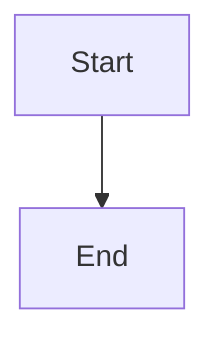

# A1 Editor Blocks Implementation Plan

> **For agentic workers:** REQUIRED SUB-SKILL: Use superpowers:subagent-driven-development (recommended) or superpowers:executing-plans to implement this plan task-by-task. Steps use checkbox (`- [ ]`) syntax for tracking.

**Goal:** Give the jots and vault-note editor (`RichMarkdownEditor`) Confluence-style blocks: callout panels, expand/collapse, status lozenges, a table of contents, Mermaid diagrams with a full-screen view, resizable images, table controls and slash-menu entries. Every block must round-trip through plain markdown exactly as the spec defines.

**Architecture:** Each block is one Tiptap extension under `desktop/src/renderer/lib/editor/`, registered in `buildEditorExtensions()` (the single schema source). Markdown parsing goes through tiptap-markdown's hooks: a markdown-it **core rule** for callouts, `parse.updateDOM` for status, TOC and tables, and attribute `parseHTML` for image widths. Serialisation uses each node's `storage.markdown.serialize`. Interactive chrome uses **vanilla ProseMirror NodeViews**, which avoids React node-view lifecycles in headless tests. React components (StatusPopover, DiagramModal, TableToolbar) are mounted by `RichMarkdownEditor` and reached through typed custom editor events. The round-trip fixture suite in `markdown-roundtrip.test.ts` gates every task.

**Tech Stack:** Electron 32, React 18, Tiptap 2.27.2, tiptap-markdown 0.8.10 (markdown-it 14.2.0, prosemirror-markdown 1.13.4), prosemirror-tables 1.8.5 (via `@tiptap/pm/tables`), Vitest 2 + jsdom + Testing Library, **mermaid 11.17.2** (new).

**Spec:** `docs/superpowers/specs/2026-10-09-confluence-editor-design.md`. This plan covers slice **A1 Blocks** only. A2–A6 are out of scope. Background for the editor: `docs/superpowers/specs/2026-06-09-rich-markdown-editor-design.md`.

## Global Constraints

- Files on disk stay plain markdown. `Markdown.configure({ html: false, ... })` in `extensions.ts` stays exactly as it is, and no block may serialise to HTML.
- `buildEditorExtensions()` in `desktop/src/renderer/lib/editor/extensions.ts` stays the single source of truth for the schema. Every new block gets fixtures in `desktop/src/renderer/__tests__/markdown-roundtrip.test.ts`, and that test gates each task.
- Callout on-disk form: `> [!info] Optional title` + `> body` lines. Types: `info note tip warning error success`. Only a first line matching `^\[!(info|note|tip|warning|error|success)\][+-]?` becomes a callout node.
- Expand/collapse on-disk form: foldable callout `> [!note]- Title` (`-` = starts collapsed, `+` = starts open).
- Status on-disk form: inline code `` `status:In progress/yellow` ``. Colours: `grey blue green yellow red purple`. Any inline code starting with `status:` renders as a lozenge; that collision is accepted.
- TOC on-disk form: an empty fenced block ` ```toc ` / ` ``` `.
- Mermaid on-disk form: a ` ```mermaid ` fence. `mermaid` is loaded lazily with dynamic `import()`. A render error shows the source plus the error text and never throws.
- Image width on-disk form: Obsidian alt-pipe ``. The drag handle snaps to 25 / 50 / 75 / 100 %.
- Table alignment is stored in the GFM delimiter row. Merged cells and multi-column layouts are non-goals.
- "Never block opening a note": a block that fails to parse falls back to its plain markdown form, and the existing `parsesAsRich` probe still covers anything that throws.
- A1 is renderer only: no sidecar, IPC or preload changes.
- New dependencies: `mermaid@11.17.2`, plus `@tiptap/extension-code-block@2.27.2`, which was already installed transitively and is now declared explicitly. Both are pinned exactly (`--save-exact`). No others.
- Run every command from `desktop/`. Typecheck is `npm run typecheck` (`tsc -b`), **not** `tsc --noEmit`. Tests: `npx vitest run <file>`. Lint: `npx eslint --max-warnings 0 <files>`.
- Copy in UI strings is lower-case, matching the app (`copy formatted`, `rich`, `src`).

## Review Focus

1. **Obsidian callouts of other types (`[!quote]`, `[!INFO]`, `[!abstract]`) already in the vault.** They must stay plain blockquotes and never become a callout with the wrong kind. They keep today's behaviour unchanged. Pinned in Task 1 (`keeps unknown and upper-case markers as plain blockquotes`).
2. **Enter inside a table cell (two paragraphs in one cell), or toggling the header row off.** Today tiptap-markdown writes the literal placeholder `[table]` and the table's content is lost on save. The file must keep a valid GFM table. Pinned in Task 9 (`never writes the [table] placeholder`, `headerless table`).
3. **A `|` typed inside a table cell.** It must be written as `\|` so the row doesn't split into extra columns. Pinned in Task 9 (fixture `table cell with escaped pipe`).
4. **A broken Mermaid diagram, or rapid edits while an earlier render is still in flight.** Expected: an inline error box with source and message, no throw, and an older render never overwriting a newer one. Pinned in Task 6 (`shows the error box…`, `only the latest edit renders`).
5. **A status label containing a backtick, or a label cleared to empty in the popover.** Expected: a backtick produces a valid longer code-span fence; an empty label is not saved and the popover stays open. Pinned in Task 3 (fixture `status label with backtick`) and Task 4 (`does not save an empty label`).

## Decisions taken where the spec leaves room

- **Callout title is stored raw.** The title is the raw source text after the marker, kept verbatim in a `title` attribute and edited in a plain input. It is never parsed as inline markdown, so `*x*` in a title round-trips byte-exact and displays literally.
- **Blank `>` line after the header is normalised.** `> [!info] T` + `>` + `> body` becomes `> [!info] T` + `> body` after one save. The two forms are equivalent in Obsidian and GitHub. Pinned as a test.
- **Expand inserted from the slash menu** is `[!note]+ Details` (starts open so the user can type). Clicking the chevron writes `-` or `+` to the file, as the spec says ("the chevron toggles `foldable`"). In a read-only editor the chevron folds visually only and never writes.
- **Image width is stored in pixels and snapped to percentages.** The alt-pipe stores pixels, but the handle snaps to 25 / 50 / 75 % of the editor's content width, rounded to whole pixels. 100 % **removes** the width (``).
- **Headerless tables** (header row toggled off) serialise with an empty GFM header row (`|  |  |`). On parse, an all-empty header row above at least one body row becomes a headerless table again, so the toggle round-trips. A multi-paragraph cell joins its paragraphs with a single space.
- **TOC parsing is narrow.** Only an **empty** ` ```toc ` fence becomes a TOC node. A toc fence with content (Obsidian TOC-plugin options) stays a code block, so nothing is lost.
- **Status text.** `status:Label` without a valid `/colour` suffix keeps `color: null` and round-trips without a suffix. `status:` with an empty label stays plain inline code.
- **The table toolbar is a sticky contextual bar** at the top of the editor scroll area. It is visible only while the cursor is in a table. It is not anchored to the table's screen coordinates, which needs no popper dependency and stays testable in jsdom.
- **Callout icons** are text glyphs rendered in a vanilla node view. React/Lucide is not used inside node views.
- **Mermaid version.** mermaid **11.17.2** is the latest 11.x, released 2026-08-25. The brand-new 12.x major is deliberately skipped. It brings in `d3`, which A6 can reuse for `d3-force`.

---

## File Structure

Create (all under `desktop/src/renderer/`):

| File | Responsibility |
|---|---|
| `lib/editor/events.ts` | Typed custom editor events (`gb:status:edit`, `gb:diagram:open`): `emitGb` / `onGb` |
| `lib/editor/callout-format.ts` | Pure callout grammar: kinds, header parse/print, title sanitising, markdown-it core rule |
| `lib/editor/callout.ts` | `callout` node: schema, commands, markdown serialize/parse, node view hookup |
| `lib/editor/callout-view.ts` | Vanilla NodeView: header (chevron, glyph, kind select, title input) and body |
| `lib/editor/status.ts` | `status` inline atom: parse/serialize, commands, click → edit event |
| `lib/editor/toc.ts` | `toc` atom block: parse/serialize, `collectHeadings`, live NodeView |
| `lib/editor/mermaid-render.ts` | Lazy `import('mermaid')` and `renderMermaid(source)` → result union |
| `lib/editor/code-block.ts` | `GbCodeBlock` = CodeBlock + NodeView (Mermaid preview for `language === 'mermaid'`) |
| `lib/editor/image-view.ts` | Image NodeView with resize handle; `snapWidth` |
| `lib/editor/table.ts` | Cell `align` attrs, GFM-safe table serializer, headerless parse, `setColumnAlign` |
| `components/StatusPopover.tsx` | Edit the label and colour of one status node |
| `components/DiagramModal.tsx` | Full-screen Mermaid view with pan and zoom |
| `components/TableToolbar.tsx` | Contextual table controls |
| `__tests__/helpers/editor.ts` | Headless editor helpers for tests |
| `__tests__/callout.test.ts`, `callout-view.test.ts`, `status.test.ts`, `StatusPopover.test.tsx`, `toc.test.ts`, `mermaid-render.test.ts`, `mermaid-view.test.ts`, `DiagramModal.test.tsx`, `image-width.test.ts`, `table-markdown.test.ts`, `TableToolbar.test.tsx` | Tests per unit |

Modify:

| File | Change |
|---|---|
| `lib/editor/extensions.ts` | Register Callout, Status, Toc, GbCodeBlock, GbTable, GbTableCell, GbTableHeader; `StarterKit.configure({ blockquote: false, codeBlock: false })` |
| `lib/editor/image.ts` | `width` attribute, alt-pipe parse/serialize, `setImageWidth`, node view |
| `lib/editor/slash.ts` | New slash items |
| `components/RichMarkdownEditor.tsx` | Mount StatusPopover, DiagramModal, TableToolbar |
| `styles.css` | Block styles |
| `__tests__/markdown-roundtrip.test.ts`, `__tests__/slash.test.ts` | Fixtures and tests |
| `package.json`, `package-lock.json` | mermaid, explicit code-block dependency |

---

### Task 1: Callout node with markdown round-trip

**Files:**
- Create: `desktop/src/renderer/lib/editor/callout-format.ts`
- Create: `desktop/src/renderer/lib/editor/callout.ts`
- Create: `desktop/src/renderer/__tests__/helpers/editor.ts`
- Create: `desktop/src/renderer/__tests__/callout.test.ts`
- Modify: `desktop/src/renderer/lib/editor/extensions.ts`
- Modify: `desktop/src/renderer/__tests__/markdown-roundtrip.test.ts`
- Modify: `desktop/src/renderer/styles.css` (append)

**Interfaces:**
- Consumes: `buildEditorExtensions()` (extensions.ts), `getMarkdown(editor)` (markdown.ts).
- Produces:
  - `callout-format.ts`: `CALLOUT_KINDS: readonly ['info','note','tip','warning','error','success']`, `type CalloutKind`, `type CalloutFoldable = 'none' | 'open' | 'closed'`, `interface CalloutAttrs { kind: CalloutKind; title: string | null; foldable: CalloutFoldable }`, `parseCalloutHeader(line: string): CalloutAttrs | null`, `calloutHeader(attrs: CalloutAttrs): string`, `sanitizeCalloutTitle(raw: string): string | null`, `installCalloutRule(md: MdLike): void`.
  - `callout.ts`: `Callout` node named `'callout'`; commands `setCallout(attrs?: Partial<CalloutAttrs>)`, `toggleCallout(attrs?: Partial<CalloutAttrs>)`, `unsetCallout()`.
  - `helpers/editor.ts`: `makeEditor(content: string, editable?: boolean): Editor`, `markdownOf(editor: Editor): string`, `normalizeMd(md: string): string`, `findNodePos(editor: Editor, test: (n: PMNode) => boolean): number`, `textPos(editor: Editor, text: string): number`.

- [ ] **Step 1: Write the test helper**

`desktop/src/renderer/__tests__/helpers/editor.ts`:

````ts
import { Editor } from '@tiptap/core';
import type { Node as PMNode } from '@tiptap/pm/model';
import { buildEditorExtensions } from '../../lib/editor/extensions';
import { getMarkdown } from '../../lib/editor/markdown';

/** Headless editor built from the exact production schema. */
export function makeEditor(content: string, editable = true): Editor {
  return new Editor({ extensions: buildEditorExtensions(), content, editable });
}

/** Same normalisation as markdown-roundtrip.test.ts: trailing whitespace per line + trailing newlines. */
export function normalizeMd(md: string): string {
  return md
    .split('\n')
    .map((line) => line.replace(/\s+$/, ''))
    .join('\n')
    .replace(/\n+$/, '');
}

export function markdownOf(editor: Editor): string {
  return normalizeMd(getMarkdown(editor));
}

/** Position of the first node matching `test` (document order). Throws if absent. */
export function findNodePos(editor: Editor, test: (n: PMNode) => boolean): number {
  let found = -1;
  editor.state.doc.descendants((node, pos) => {
    if (found !== -1) return false;
    if (test(node)) {
      found = pos;
      return false;
    }
    return true;
  });
  if (found === -1) throw new Error('node not found');
  return found;
}

/** Document position of the first character of `text`. Throws if absent. */
export function textPos(editor: Editor, text: string): number {
  let found = -1;
  editor.state.doc.descendants((node, pos) => {
    if (found !== -1) return false;
    if (node.isText && node.text?.includes(text)) {
      found = pos + node.text.indexOf(text);
      return false;
    }
    return true;
  });
  if (found === -1) throw new Error(`text not found: ${text}`);
  return found;
}
````

- [ ] **Step 2: Write the failing unit + structure tests**

`desktop/src/renderer/__tests__/callout.test.ts`:

````ts
import { describe, it, expect } from 'vitest';
import {
  parseCalloutHeader,
  calloutHeader,
  sanitizeCalloutTitle,
} from '../lib/editor/callout-format';
import { makeEditor, markdownOf } from './helpers/editor';

describe('parseCalloutHeader', () => {
  it('parses kind, fold marker and title', () => {
    expect(parseCalloutHeader('[!info] Heads up')).toEqual({ kind: 'info', foldable: 'none', title: 'Heads up' });
    expect(parseCalloutHeader('[!note]- Details')).toEqual({ kind: 'note', foldable: 'closed', title: 'Details' });
    expect(parseCalloutHeader('[!tip]+')).toEqual({ kind: 'tip', foldable: 'open', title: null });
    expect(parseCalloutHeader('[!success]')).toEqual({ kind: 'success', foldable: 'none', title: null });
  });

  it('keeps the title raw (markdown characters are not interpreted)', () => {
    expect(parseCalloutHeader('[!info] Use *raw* `title`')?.title).toBe('Use *raw* `title`');
  });

  it('rejects unknown, upper-case and unspaced markers', () => {
    expect(parseCalloutHeader('[!quote] x')).toBeNull();
    expect(parseCalloutHeader('[!INFO] x')).toBeNull();
    expect(parseCalloutHeader('[!info]x')).toBeNull();
    expect(parseCalloutHeader('**Extracted from photo**')).toBeNull();
  });
});

describe('calloutHeader', () => {
  it('prints the canonical header', () => {
    expect(calloutHeader({ kind: 'info', title: 'Heads up', foldable: 'none' })).toBe('[!info] Heads up');
    expect(calloutHeader({ kind: 'note', title: 'Details', foldable: 'closed' })).toBe('[!note]- Details');
    expect(calloutHeader({ kind: 'tip', title: null, foldable: 'open' })).toBe('[!tip]+');
  });
});

describe('sanitizeCalloutTitle', () => {
  it('collapses whitespace and maps blank to null', () => {
    expect(sanitizeCalloutTitle('  a \n b  ')).toBe('a b');
    expect(sanitizeCalloutTitle('   ')).toBeNull();
  });
});

describe('callout node parsing', () => {
  it('turns a marked blockquote into a callout node with attrs and body', () => {
    const editor = makeEditor('> [!warning] Careful\n> First para.\n>\n> Second para.');
    const first = editor.getJSON().content?.[0];
    expect(first).toMatchObject({ type: 'callout', attrs: { kind: 'warning', title: 'Careful', foldable: 'none' } });
    expect(first?.content?.map((c) => c.type)).toEqual(['paragraph', 'paragraph']);
    expect(JSON.stringify(first)).not.toContain('[!warning]');
  });

  it('keeps unknown and upper-case markers as plain blockquotes', () => {
    for (const md of ['> [!quote] Not ours\n> body', '> [!INFO] shout\n> body', '> **Extracted from photo**\n>\n> body']) {
      expect(makeEditor(md).getJSON().content?.[0]?.type).toBe('blockquote');
    }
  });

  it('gives a title-only callout an empty body paragraph', () => {
    const first = makeEditor('> [!success] Shipped').getJSON().content?.[0];
    expect(first).toMatchObject({ type: 'callout', attrs: { kind: 'success', title: 'Shipped' } });
    expect(first?.content).toEqual([{ type: 'paragraph' }]);
  });

  it('does not stack the core rule when the same parser runs twice', () => {
    const md = '> [!info] T\n> [!tip] literal body';
    const editor = makeEditor(md);
    editor.commands.setContent(md, false); // second parse through the same markdown-it instance
    const first = editor.getJSON().content?.[0];
    expect(first).toMatchObject({ type: 'callout', attrs: { kind: 'info', title: 'T' } });
    expect(JSON.stringify(first?.content)).toContain('[!tip] literal body');
  });

  it('normalises a blank > line after the header to the tight form, then stays stable', () => {
    const editor = makeEditor('> [!info] T\n>\n> para');
    expect(markdownOf(editor)).toBe('> [!info] T\n> para');
    editor.commands.setContent(markdownOf(editor), false);
    expect(markdownOf(editor)).toBe('> [!info] T\n> para');
  });
});

describe('callout commands', () => {
  it('setCallout wraps the current paragraph; unsetCallout lifts it back', () => {
    const editor = makeEditor('hello');
    editor.commands.setTextSelection(2);
    expect(editor.commands.setCallout({ kind: 'tip' })).toBe(true);
    expect(markdownOf(editor)).toBe('> [!tip]\n> hello');
    editor.commands.unsetCallout();
    expect(markdownOf(editor)).toBe('hello');
  });
});
````

- [ ] **Step 3: Add the round-trip fixtures (the gate)**

In `desktop/src/renderer/__tests__/markdown-roundtrip.test.ts`, add these entries to `FIXTURES` after `'extract callout'`:

````ts
  'callout with title': '> [!info] Heads up\n> Body text here.',
  'callout without title': '> [!tip]\n> Use the slash menu.',
  'callout with several paragraphs': '> [!warning] Careful\n> First para.\n>\n> Second para.',
  'callout title only': '> [!success] Shipped',
  'callout with a list body': '> [!error] Failures\n> - one\n> - two',
  'callout raw title keeps markdown characters': '> [!note] Use *raw* title\n> body',
  'foldable callout starts collapsed': '> [!note]- Details\n> Hidden body.',
  'foldable callout starts open': '> [!note]+ Details\n> Shown body.',
  'callout between paragraphs': 'before\n\n> [!info] Mid\n> body\n\nafter',
````

- [ ] **Step 4: Run tests to verify they fail**

Run: `npx vitest run src/renderer/__tests__/callout.test.ts src/renderer/__tests__/markdown-roundtrip.test.ts`
Expected: FAIL. `callout.test.ts` fails with "Failed to resolve import ../lib/editor/callout-format". The new round-trip fixtures fail because the output contains `\[!info\]` (escaped, soft break collapsed).

- [ ] **Step 5: Implement `callout-format.ts`**

````ts
/**
 * Callout grammar (spec §Markdown storage format). Obsidian/GitHub alert
 * syntax: `> [!kind][+-]? Optional title` followed by `> body` lines.
 * Only the six kinds below become callouts; anything else stays a plain
 * blockquote (ExtractCallout and other Obsidian types are untouched).
 */
export const CALLOUT_KINDS = ['info', 'note', 'tip', 'warning', 'error', 'success'] as const;
export type CalloutKind = (typeof CALLOUT_KINDS)[number];
export type CalloutFoldable = 'none' | 'open' | 'closed';

export interface CalloutAttrs {
  kind: CalloutKind;
  /** Raw source text after the marker; never parsed as inline markdown. */
  title: string | null;
  foldable: CalloutFoldable;
}

const HEADER_RE = /^\[!(info|note|tip|warning|error|success)\]([+-]?)(?:[ \t]+(.*))?$/;

export function parseCalloutHeader(line: string): CalloutAttrs | null {
  const m = HEADER_RE.exec(line);
  if (!m) return null;
  const title = (m[3] ?? '').trim();
  return {
    kind: m[1] as CalloutKind,
    foldable: m[2] === '-' ? 'closed' : m[2] === '+' ? 'open' : 'none',
    title: title === '' ? null : title,
  };
}

export function calloutHeader(attrs: CalloutAttrs): string {
  const fold = attrs.foldable === 'closed' ? '-' : attrs.foldable === 'open' ? '+' : '';
  return `[!${attrs.kind}]${fold}${attrs.title ? ` ${attrs.title}` : ''}`;
}

export function sanitizeCalloutTitle(raw: string): string | null {
  const t = raw.replace(/\s+/g, ' ').trim();
  return t === '' ? null : t;
}

export function isCalloutKind(v: unknown): v is CalloutKind {
  return typeof v === 'string' && (CALLOUT_KINDS as readonly string[]).includes(v);
}

export function isFoldable(v: unknown): v is CalloutFoldable {
  return v === 'none' || v === 'open' || v === 'closed';
}

// Minimal structural types for the markdown-it surface we touch (avoids a
// direct dependency on markdown-it's type package paths).
interface MdToken {
  type: string;
  content: string;
  attrSet(name: string, value: string): void;
}
interface MdCoreState {
  tokens: MdToken[];
}
export interface MdLike {
  core: {
    ruler: {
      after(afterName: string, ruleName: string, fn: (state: MdCoreState) => void): void;
    };
  };
}

/**
 * Runs after block parsing and before inline parsing, so we can read the raw
 * first line of the blockquote's first paragraph. Matching blockquotes get
 * data-* attrs (rendered by markdown-it's default renderer and picked up by
 * the callout node's parseHTML); the header line is removed from the body.
 */
export function calloutCoreRule(state: MdCoreState): void {
  const tokens = state.tokens;
  for (let i = 0; i + 2 < tokens.length; i++) {
    const open = tokens[i]!;
    const pOpen = tokens[i + 1]!;
    const inline = tokens[i + 2]!;
    if (open.type !== 'blockquote_open' || pOpen.type !== 'paragraph_open' || inline.type !== 'inline') {
      continue;
    }
    const nl = inline.content.indexOf('\n');
    const firstLine = nl === -1 ? inline.content : inline.content.slice(0, nl);
    const attrs = parseCalloutHeader(firstLine);
    if (!attrs) continue;
    open.attrSet('data-callout', attrs.kind);
    open.attrSet('data-foldable', attrs.foldable);
    if (attrs.title) open.attrSet('data-title', attrs.title);
    const rest = nl === -1 ? '' : inline.content.slice(nl + 1);
    if (rest.trim() === '') {
      tokens.splice(i + 1, 3); // drop paragraph_open, inline, paragraph_close
    } else {
      inline.content = rest;
    }
  }
}

// tiptap-markdown calls parse.setup on EVERY parse with the same markdown-it
// instance — install the rule once per instance.
const installed = new WeakSet<object>();

export function installCalloutRule(md: MdLike): void {
  if (installed.has(md)) return;
  installed.add(md);
  md.core.ruler.after('block', 'gb_callout', calloutCoreRule);
}
````

- [ ] **Step 6: Implement `callout.ts`**

````ts
import { Node, mergeAttributes } from '@tiptap/core';
import type { MarkdownSerializerState } from 'prosemirror-markdown';
import type { Node as PMNode } from 'prosemirror-model';
import {
  calloutHeader,
  installCalloutRule,
  isCalloutKind,
  isFoldable,
  type CalloutAttrs,
  type MdLike,
} from './callout-format';

declare module '@tiptap/core' {
  interface Commands<ReturnType> {
    callout: {
      setCallout: (attrs?: Partial<CalloutAttrs>) => ReturnType;
      toggleCallout: (attrs?: Partial<CalloutAttrs>) => ReturnType;
      unsetCallout: () => ReturnType;
    };
  }
}

function isEmptyBody(node: PMNode): boolean {
  const only = node.childCount === 1 ? node.firstChild : null;
  return !!only && only.isTextblock && only.content.size === 0;
}

export function serializeCallout(state: MarkdownSerializerState, node: PMNode): void {
  const attrs = node.attrs as CalloutAttrs;
  state.wrapBlock('> ', null, node, () => {
    state.write(calloutHeader(attrs));
    if (!isEmptyBody(node)) {
      state.ensureNewLine();
      state.renderContent(node);
    }
  });
}

export const Callout = Node.create({
  name: 'callout',
  group: 'block',
  content: 'block+',
  defining: true,

  addAttributes() {
    return {
      kind: {
        default: 'info',
        parseHTML: (el: HTMLElement) => {
          const v = el.getAttribute('data-callout');
          return isCalloutKind(v) ? v : 'info';
        },
        renderHTML: (a: { kind: string }) => ({ 'data-callout': a.kind }),
      },
      title: {
        default: null,
        parseHTML: (el: HTMLElement) => el.getAttribute('data-title') || null,
        renderHTML: (a: { title: string | null }) => (a.title ? { 'data-title': a.title } : {}),
      },
      foldable: {
        default: 'none',
        parseHTML: (el: HTMLElement) => {
          const v = el.getAttribute('data-foldable');
          return isFoldable(v) ? v : 'none';
        },
        renderHTML: (a: { foldable: string }) => ({ 'data-foldable': a.foldable }),
      },
    };
  },

  parseHTML() {
    return [
      {
        tag: 'blockquote[data-callout]',
        priority: 60, // beats ExtractCallout's plain `blockquote` rule (50)
        contentElement: (el: HTMLElement) =>
          (el.querySelector(':scope > .gb-callout-body') as HTMLElement | null) ?? el,
      },
    ];
  },

  renderHTML({ node, HTMLAttributes }) {
    // Used for getHTML (copy formatted / PDF): show the title above the body.
    const attrs = mergeAttributes(HTMLAttributes, { class: 'gb-callout' });
    const title = (node.attrs as CalloutAttrs).title;
    return title
      ? ['blockquote', attrs, ['p', { class: 'gb-callout-title-html' }, title], ['div', { class: 'gb-callout-body' }, 0]]
      : ['blockquote', attrs, ['div', { class: 'gb-callout-body' }, 0]];
  },

  addCommands() {
    return {
      setCallout:
        (attrs = {}) =>
        ({ commands }) =>
          commands.wrapIn(this.name, attrs),
      toggleCallout:
        (attrs = {}) =>
        ({ commands }) =>
          commands.toggleWrap(this.name, attrs),
      unsetCallout:
        () =>
        ({ commands }) =>
          commands.lift(this.name),
    };
  },

  addStorage() {
    return {
      markdown: {
        serialize: serializeCallout,
        parse: {
          setup(md: MdLike) {
            installCalloutRule(md);
          },
        },
      },
    };
  },
});
````

- [ ] **Step 7: Register in `extensions.ts`**

Add `import { Callout } from './callout';` and insert `Callout,` directly after `ExtractCallout,` in the returned array.

- [ ] **Step 8: Append callout styles to `styles.css`**

````css
/* ── A1 editor blocks ─────────────────────────────────────────────── */
.gb-prose {
  --gb-amber: #e8b34b;
  --gb-plum: #b58ce0;
}
.gb-callout {
  --callout-accent: var(--pill-water-fg);
  border-left: 3px solid var(--callout-accent);
  background: var(--vellum);
  border-radius: 0 6px 6px 0;
  padding: 6px 12px 2px;
  margin: 0 0 1em;
  font-style: normal;
  color: var(--ink-0);
}
.gb-callout[data-callout='note'],
.gb-callout[data-kind='note'] { --callout-accent: var(--ink-2); }
.gb-callout[data-callout='tip'],
.gb-callout[data-kind='tip'] { --callout-accent: var(--neon); }
.gb-callout[data-callout='warning'],
.gb-callout[data-kind='warning'] { --callout-accent: var(--gb-amber); }
.gb-callout[data-callout='error'],
.gb-callout[data-kind='error'] { --callout-accent: var(--oxblood); }
.gb-callout[data-callout='success'],
.gb-callout[data-kind='success'] { --callout-accent: var(--pill-moss-fg); }
````

(`.gb-prose blockquote` sets italic. `.gb-callout` resets `font-style`, and its selector comes later in the file, so it wins.)

- [ ] **Step 9: Run tests to verify they pass**

Run: `npx vitest run src/renderer/__tests__/callout.test.ts src/renderer/__tests__/markdown-roundtrip.test.ts src/renderer/__tests__/RichMarkdownEditor.test.tsx`
Expected: PASS (all existing round-trip fixtures, including `extract callout` and the tight-backend test, still pass).

- [ ] **Step 10: Typecheck + lint**

Run: `npm run typecheck && npx eslint --max-warnings 0 src/renderer/lib/editor src/renderer/__tests__/callout.test.ts src/renderer/__tests__/helpers`
Expected: no errors.

- [ ] **Step 11: Commit**

```bash
git add src/renderer/lib/editor/callout-format.ts src/renderer/lib/editor/callout.ts src/renderer/lib/editor/extensions.ts src/renderer/__tests__/helpers/editor.ts src/renderer/__tests__/callout.test.ts src/renderer/__tests__/markdown-roundtrip.test.ts src/renderer/styles.css
git commit -m "feat(editor): callout panels with obsidian alert round-trip"
```

---

### Task 2: Callout node view (kind, title, expand/collapse)

**Files:**
- Create: `desktop/src/renderer/lib/editor/callout-view.ts`
- Create: `desktop/src/renderer/__tests__/callout-view.test.ts`
- Modify: `desktop/src/renderer/lib/editor/callout.ts` (add `addNodeView`)
- Modify: `desktop/src/renderer/styles.css` (append)

**Interfaces:**
- Consumes: `CALLOUT_KINDS`, `CalloutAttrs`, `CalloutKind`, `CalloutFoldable`, `sanitizeCalloutTitle` (Task 1); `makeEditor`, `markdownOf` (Task 1 helpers).
- Produces: `createCalloutView(node: PMNode, editor: Editor, getPos: () => number | undefined): NodeView`, `CALLOUT_GLYPH: Record<CalloutKind, string>`, `nextFoldable(f: CalloutFoldable): CalloutFoldable`. DOM contract: `.gb-callout[data-kind][data-foldable][data-collapsed]` > `.gb-callout-header` (button `aria-label="toggle callout"`, select `aria-label="callout type"`, input `aria-label="callout title"`) and `.gb-callout-body` (contentDOM).

- [ ] **Step 1: Write the failing test**

`desktop/src/renderer/__tests__/callout-view.test.ts`:

````ts
import { describe, it, expect } from 'vitest';
import { fireEvent } from '@testing-library/react';
import { makeEditor, markdownOf } from './helpers/editor';
import { nextFoldable } from '../lib/editor/callout-view';

function q<T extends Element>(root: Element, sel: string): T {
  const el = root.querySelector(sel);
  if (!el) throw new Error(`missing ${sel}`);
  return el as T;
}

describe('callout node view', () => {
  it('renders header + body with kind and title', () => {
    const editor = makeEditor('> [!warning] Careful\n> body');
    const dom = q<HTMLElement>(editor.view.dom, '.gb-callout');
    expect(dom.dataset.kind).toBe('warning');
    expect(q<HTMLInputElement>(dom, '[aria-label="callout title"]').value).toBe('Careful');
    expect(q<HTMLSelectElement>(dom, '[aria-label="callout type"]').value).toBe('warning');
    expect(q<HTMLElement>(dom, '.gb-callout-body').textContent).toBe('body');
  });

  it('hides the chevron for non-foldable callouts', () => {
    const editor = makeEditor('> [!info] T\n> body');
    expect(q<HTMLButtonElement>(editor.view.dom, '[aria-label="toggle callout"]').hidden).toBe(true);
  });

  it('chevron toggles foldable and writes the marker to markdown', () => {
    const editor = makeEditor('> [!note]+ Details\n> body');
    const chevron = q<HTMLButtonElement>(editor.view.dom, '[aria-label="toggle callout"]');
    fireEvent.click(chevron);
    expect(markdownOf(editor)).toBe('> [!note]- Details\n> body');
    expect(q<HTMLElement>(editor.view.dom, '.gb-callout').dataset.collapsed).toBe('true');
    fireEvent.click(q(editor.view.dom, '[aria-label="toggle callout"]'));
    expect(markdownOf(editor)).toBe('> [!note]+ Details\n> body');
  });

  it('title input commits a sanitised title; blank removes it', () => {
    const editor = makeEditor('> [!info] Old\n> body');
    const input = q<HTMLInputElement>(editor.view.dom, '[aria-label="callout title"]');
    fireEvent.change(input, { target: { value: '  New   title ' } });
    expect(markdownOf(editor)).toBe('> [!info] New title\n> body');
    fireEvent.change(q(editor.view.dom, '[aria-label="callout title"]'), { target: { value: '  ' } });
    expect(markdownOf(editor)).toBe('> [!info]\n> body');
  });

  it('kind select changes the callout type', () => {
    const editor = makeEditor('> [!info] T\n> body');
    fireEvent.change(q(editor.view.dom, '[aria-label="callout type"]'), { target: { value: 'error' } });
    expect(markdownOf(editor)).toBe('> [!error] T\n> body');
  });

  it('read-only: chevron folds visually but never changes the document', () => {
    const editor = makeEditor('> [!note]+ Details\n> body', false);
    fireEvent.click(q(editor.view.dom, '[aria-label="toggle callout"]'));
    expect(markdownOf(editor)).toBe('> [!note]+ Details\n> body');
    expect(q<HTMLElement>(editor.view.dom, '.gb-callout').dataset.collapsed).toBe('true');
    expect(q<HTMLInputElement>(editor.view.dom, '[aria-label="callout title"]').readOnly).toBe(true);
  });

  it('nextFoldable flips open/closed', () => {
    expect(nextFoldable('open')).toBe('closed');
    expect(nextFoldable('closed')).toBe('open');
  });
});
````

- [ ] **Step 2: Run test to verify it fails**

Run: `npx vitest run src/renderer/__tests__/callout-view.test.ts`
Expected: FAIL with "Failed to resolve import ../lib/editor/callout-view".

- [ ] **Step 3: Implement `callout-view.ts`**

````ts
import type { Editor } from '@tiptap/core';
import type { Node as PMNode } from 'prosemirror-model';
import type { NodeView } from '@tiptap/pm/view';
import {
  CALLOUT_KINDS,
  sanitizeCalloutTitle,
  type CalloutAttrs,
  type CalloutFoldable,
  type CalloutKind,
} from './callout-format';

export const CALLOUT_GLYPH: Record<CalloutKind, string> = {
  info: 'i',
  note: '✎',
  tip: '✦',
  warning: '!',
  error: '×',
  success: '✓',
};

export function nextFoldable(f: CalloutFoldable): CalloutFoldable {
  return f === 'closed' ? 'open' : 'closed';
}

export function createCalloutView(
  node: PMNode,
  editor: Editor,
  getPos: () => number | undefined,
): NodeView {
  let current = node;
  // Read-only editors fold visually without writing; null = follow attrs.
  let localCollapsed: boolean | null = null;

  const dom = document.createElement('div');
  dom.className = 'gb-callout';

  const header = document.createElement('div');
  header.className = 'gb-callout-header';
  header.contentEditable = 'false';

  const chevron = document.createElement('button');
  chevron.type = 'button';
  chevron.className = 'gb-callout-chevron';
  chevron.setAttribute('aria-label', 'toggle callout');

  const glyph = document.createElement('span');
  glyph.className = 'gb-callout-glyph';

  const kindSelect = document.createElement('select');
  kindSelect.className = 'gb-callout-kind';
  kindSelect.setAttribute('aria-label', 'callout type');
  for (const k of CALLOUT_KINDS) {
    const opt = document.createElement('option');
    opt.value = k;
    opt.textContent = k;
    kindSelect.appendChild(opt);
  }

  const titleInput = document.createElement('input');
  titleInput.className = 'gb-callout-title';
  titleInput.placeholder = 'title';
  titleInput.setAttribute('aria-label', 'callout title');

  header.append(chevron, glyph, kindSelect, titleInput);

  const body = document.createElement('div');
  body.className = 'gb-callout-body';
  dom.append(header, body);

  function attrs(): CalloutAttrs {
    return current.attrs as CalloutAttrs;
  }

  function setAttrs(patch: Partial<CalloutAttrs>): void {
    const pos = getPos();
    if (typeof pos !== 'number' || !editor.isEditable) return;
    editor.view.dispatch(editor.state.tr.setNodeMarkup(pos, undefined, { ...current.attrs, ...patch }));
  }

  function sync(): void {
    const a = attrs();
    const collapsed = localCollapsed ?? a.foldable === 'closed';
    dom.dataset.kind = a.kind;
    dom.dataset.foldable = a.foldable;
    dom.dataset.collapsed = String(collapsed);
    chevron.hidden = a.foldable === 'none';
    chevron.textContent = collapsed ? '▸' : '▾';
    glyph.textContent = CALLOUT_GLYPH[a.kind];
    kindSelect.value = a.kind;
    kindSelect.disabled = !editor.isEditable;
    titleInput.readOnly = !editor.isEditable;
    if (document.activeElement !== titleInput) titleInput.value = a.title ?? '';
  }

  chevron.addEventListener('click', (e) => {
    e.preventDefault();
    const a = attrs();
    if (a.foldable === 'none') return;
    if (!editor.isEditable) {
      localCollapsed = !(localCollapsed ?? a.foldable === 'closed');
      sync();
      return;
    }
    setAttrs({ foldable: nextFoldable(a.foldable) });
  });

  kindSelect.addEventListener('change', () => {
    setAttrs({ kind: kindSelect.value as CalloutKind });
  });

  const commitTitle = (): void => {
    const next = sanitizeCalloutTitle(titleInput.value);
    if (next !== attrs().title) setAttrs({ title: next });
  };
  titleInput.addEventListener('change', commitTitle);
  titleInput.addEventListener('keydown', (e) => {
    if (e.key === 'Enter') {
      e.preventDefault();
      commitTitle();
      editor.commands.focus();
    }
  });

  sync();

  return {
    dom,
    contentDOM: body,
    update(next) {
      if (next.type !== current.type) return false;
      current = next;
      sync();
      return true;
    },
    stopEvent(event) {
      return header.contains(event.target as globalThis.Node);
    },
    ignoreMutation(mutation) {
      return mutation.type !== 'selection' && !body.contains(mutation.target as globalThis.Node);
    },
  };
}
````

- [ ] **Step 4: Hook the view into `callout.ts`**

Add `import { createCalloutView } from './callout-view';` and this method inside `Node.create({...})` after `renderHTML`:

````ts
  addNodeView() {
    return ({ node, editor, getPos }) =>
      createCalloutView(node, editor, () => (typeof getPos === 'function' ? getPos() : undefined));
  },
````

- [ ] **Step 5: Append view styles to `styles.css`**

````css
.gb-callout-header {
  display: flex;
  align-items: center;
  gap: 6px;
  margin-bottom: 4px;
  font-size: 12px;
}
.gb-callout-chevron {
  width: 16px;
  color: var(--ink-2);
  background: transparent;
  border: 0;
  cursor: pointer;
}
.gb-callout-glyph {
  display: inline-flex;
  width: 16px;
  height: 16px;
  align-items: center;
  justify-content: center;
  border-radius: 999px;
  font-weight: 700;
  color: var(--bg-paper);
  background: var(--callout-accent);
}
.gb-callout-kind {
  background: transparent;
  border: 0;
  color: var(--ink-2);
  font-family: var(--font-mono, monospace);
  font-size: 10px;
}
.gb-callout-title {
  flex: 1;
  background: transparent;
  border: 0;
  outline: none;
  font-weight: 600;
  color: var(--ink-0);
}
.gb-callout[data-collapsed='true'] > .gb-callout-body { display: none; }
````

- [ ] **Step 6: Run tests to verify they pass**

Run: `npx vitest run src/renderer/__tests__/callout-view.test.ts src/renderer/__tests__/callout.test.ts src/renderer/__tests__/markdown-roundtrip.test.ts`
Expected: PASS.

- [ ] **Step 7: Typecheck + lint**

Run: `npm run typecheck && npx eslint --max-warnings 0 src/renderer/lib/editor src/renderer/__tests__/callout-view.test.ts`
Expected: no errors.

- [ ] **Step 8: Commit**

```bash
git add src/renderer/lib/editor/callout-view.ts src/renderer/lib/editor/callout.ts src/renderer/__tests__/callout-view.test.ts src/renderer/styles.css
git commit -m "feat(editor): callout header with kind, title and expand/collapse"
```

---

### Task 3: Status lozenge node

**Files:**
- Create: `desktop/src/renderer/lib/editor/events.ts`
- Create: `desktop/src/renderer/lib/editor/status.ts`
- Create: `desktop/src/renderer/__tests__/status.test.ts`
- Modify: `desktop/src/renderer/lib/editor/extensions.ts`
- Modify: `desktop/src/renderer/__tests__/markdown-roundtrip.test.ts`
- Modify: `desktop/src/renderer/styles.css` (append)

**Interfaces:**
- Consumes: `makeEditor`, `markdownOf`, `findNodePos` (Task 1 helpers).
- Produces:
  - `events.ts`: `interface GbEditorEvents { 'gb:status:edit': { pos: number }; 'gb:diagram:open': { source: string } }`, `emitGb<K>(editor, event: K, payload: GbEditorEvents[K]): void`, `onGb<K>(editor, event: K, handler: (p: GbEditorEvents[K]) => void): () => void` (returns an unsubscribe function).
  - `status.ts`: `STATUS_COLORS`, `type StatusColor`, `interface StatusAttrs { label: string; color: StatusColor | null }`, `parseStatusText(text: string): StatusAttrs | null`, `statusMarkdown(attrs: StatusAttrs): string`, `codeSpan(text: string): string`, `sanitizeStatusLabel(raw: string): string`, the `Status` node (`'status'`), commands `insertStatus(attrs: StatusAttrs)` and `updateStatusAt(pos: number, attrs: Partial<StatusAttrs>)`. Clicking a status in an editable editor emits `gb:status:edit` with the node's position.

- [ ] **Step 1: Write the failing tests**

`desktop/src/renderer/__tests__/status.test.ts`:

````ts
import { describe, it, expect, vi } from 'vitest';
import { codeSpan, parseStatusText, sanitizeStatusLabel, statusMarkdown } from '../lib/editor/status';
import { onGb } from '../lib/editor/events';
import { findNodePos, makeEditor, markdownOf } from './helpers/editor';

describe('parseStatusText', () => {
  it('parses label and colour', () => {
    expect(parseStatusText('status:In progress/yellow')).toEqual({ label: 'In progress', color: 'yellow' });
  });
  it('keeps colour null when the suffix is absent or unknown', () => {
    expect(parseStatusText('status:Blocked')).toEqual({ label: 'Blocked', color: null });
    expect(parseStatusText('status:a/orange')).toEqual({ label: 'a/orange', color: null });
  });
  it('rejects non-status and empty labels', () => {
    expect(parseStatusText('route_event')).toBeNull();
    expect(parseStatusText('status:')).toBeNull();
    expect(parseStatusText('status:/red')).toBeNull();
  });
});

describe('codeSpan / statusMarkdown', () => {
  it('uses a fence longer than any backtick run inside', () => {
    expect(codeSpan('status:x/red')).toBe('`status:x/red`');
    expect(codeSpan('status:a`b/red')).toBe('``status:a`b/red``');
    expect(codeSpan('status:a`')).toBe('`` status:a` ``');
  });
  it('omits the colour suffix when colour is null', () => {
    expect(statusMarkdown({ label: 'Blocked', color: null })).toBe('`status:Blocked`');
    expect(statusMarkdown({ label: 'Done', color: 'green' })).toBe('`status:Done/green`');
  });
  it('sanitizeStatusLabel strips newlines and trims', () => {
    expect(sanitizeStatusLabel('  Done \n now ')).toBe('Done now');
  });
});

describe('status node', () => {
  it('parses status code spans into status atoms; other code stays a mark', () => {
    const editor = makeEditor('a `status:Done/green` b `route_event`');
    const json = JSON.stringify(editor.getJSON());
    expect(json).toContain('"type":"status"');
    expect(json).toContain('"label":"Done"');
    expect(json).toContain('"type":"code"');
  });

  it('does not touch status-like text inside fenced code', () => {
    const editor = makeEditor('```\n`status:x/red`\n```');
    expect(JSON.stringify(editor.getJSON())).not.toContain('"type":"status"');
  });

  it('insertStatus and updateStatusAt write markdown', () => {
    const editor = makeEditor('x');
    editor.commands.setTextSelection(2);
    editor.commands.insertStatus({ label: 'To do', color: 'grey' });
    expect(markdownOf(editor)).toBe('x`status:To do/grey`');
    const pos = findNodePos(editor, (n) => n.type.name === 'status');
    expect(editor.commands.updateStatusAt(pos, { label: 'Done', color: 'green' })).toBe(true);
    expect(markdownOf(editor)).toBe('x`status:Done/green`');
  });

  it('updateStatusAt refuses a position that is not a status', () => {
    const editor = makeEditor('plain');
    expect(editor.commands.updateStatusAt(0, { label: 'x' })).toBe(false);
  });

  it('clicking a status emits gb:status:edit with its position (editable only)', () => {
    const editor = makeEditor('a `status:Done/green`');
    const spy = vi.fn();
    const off = onGb(editor, 'gb:status:edit', spy);
    const pos = findNodePos(editor, (n) => n.type.name === 'status');
    const node = editor.state.doc.nodeAt(pos)!;
    const view = editor.view;
    const handled = view.someProp('handleClickOn', (f) =>
      f(view, pos + 1, node, pos, new MouseEvent('click'), true),
    );
    expect(handled).toBe(true);
    expect(spy).toHaveBeenCalledWith({ pos });
    off();

    const ro = makeEditor('a `status:Done/green`', false);
    const roPos = findNodePos(ro, (n) => n.type.name === 'status');
    const roHandled = ro.view.someProp('handleClickOn', (f) =>
      f(ro.view, roPos + 1, ro.state.doc.nodeAt(roPos)!, roPos, new MouseEvent('click'), true),
    );
    expect(roHandled).toBeFalsy();
  });
});
````

Add to `FIXTURES` in `markdown-roundtrip.test.ts`:

````ts
  'status lozenge': 'Build is `status:In progress/yellow` today',
  'status without colour': 'State: `status:Blocked`',
  'status-like code with unknown colour': 'see `status:a/orange` here',
  'status label with backtick': 'odd ``status:a`b/red`` label',
  'empty status label stays inline code': 'not a lozenge: `status:`',
  'status inside bold': '**`status:Done/green`**',
````

- [ ] **Step 2: Run tests to verify they fail**

Run: `npx vitest run src/renderer/__tests__/status.test.ts src/renderer/__tests__/markdown-roundtrip.test.ts`
Expected: FAIL. The status test fails with "Failed to resolve import ../lib/editor/status". The new fixtures still pass today, because the `code` mark round-trips them. That is fine: they must **keep** passing once the status node takes over.

- [ ] **Step 3: Implement `events.ts`**

````ts
import type { Editor } from '@tiptap/core';

/**
 * Custom editor events. Tiptap's EditorEvents is closed (see slash.ts
 * gb:slash:photo), so these go through a loose emitter cast — this module is
 * the only place that cast lives.
 */
export interface GbEditorEvents {
  'gb:status:edit': { pos: number };
  'gb:diagram:open': { source: string };
}

type GbEventName = keyof GbEditorEvents;

interface LooseEmitter {
  emit(event: string, payload: unknown): unknown;
  on(event: string, fn: (payload: unknown) => void): unknown;
  off(event: string, fn: (payload: unknown) => void): unknown;
}

export function emitGb<K extends GbEventName>(editor: Editor, event: K, payload: GbEditorEvents[K]): void {
  (editor as unknown as LooseEmitter).emit(event, payload);
}

export function onGb<K extends GbEventName>(
  editor: Editor,
  event: K,
  handler: (payload: GbEditorEvents[K]) => void,
): () => void {
  const emitter = editor as unknown as LooseEmitter;
  const fn = (p: unknown): void => handler(p as GbEditorEvents[K]);
  emitter.on(event, fn);
  return () => {
    emitter.off(event, fn);
  };
}
````

- [ ] **Step 4: Implement `status.ts`**

````ts
import { Node, mergeAttributes } from '@tiptap/core';
import { Plugin, PluginKey } from '@tiptap/pm/state';
import type { MarkdownSerializerState } from 'prosemirror-markdown';
import type { Node as PMNode } from 'prosemirror-model';
import { emitGb } from './events';

export const STATUS_COLORS = ['grey', 'blue', 'green', 'yellow', 'red', 'purple'] as const;
export type StatusColor = (typeof STATUS_COLORS)[number];

export interface StatusAttrs {
  label: string;
  color: StatusColor | null;
}

declare module '@tiptap/core' {
  interface Commands<ReturnType> {
    status: {
      insertStatus: (attrs: StatusAttrs) => ReturnType;
      updateStatusAt: (pos: number, attrs: Partial<StatusAttrs>) => ReturnType;
    };
  }
}

const PREFIX = 'status:';
const COLOR_SUFFIX_RE = /^([\s\S]*)\/(grey|blue|green|yellow|red|purple)$/;

function isStatusColor(v: unknown): v is StatusColor {
  return typeof v === 'string' && (STATUS_COLORS as readonly string[]).includes(v);
}

export function parseStatusText(text: string): StatusAttrs | null {
  if (!text.startsWith(PREFIX)) return null;
  const body = text.slice(PREFIX.length);
  const m = COLOR_SUFFIX_RE.exec(body);
  const label = m ? m[1]! : body;
  if (label.trim() === '') return null;
  return { label, color: m ? (m[2] as StatusColor) : null };
}

/** CommonMark code span whose fence is longer than any backtick run inside. */
export function codeSpan(text: string): string {
  const longest = Math.max(0, ...(text.match(/`+/g) ?? []).map((run) => run.length));
  const fence = '`'.repeat(longest + 1);
  const pad = text.startsWith('`') || text.endsWith('`') ? ' ' : '';
  return `${fence}${pad}${text}${pad}${fence}`;
}

export function statusMarkdown(attrs: StatusAttrs): string {
  return codeSpan(`${PREFIX}${attrs.label}${attrs.color ? `/${attrs.color}` : ''}`);
}

export function sanitizeStatusLabel(raw: string): string {
  return raw.replace(/\s+/g, ' ').trim();
}

/** parse.updateDOM: inline <code> (not in <pre>) starting with status: → span[data-status]. */
export function replaceStatusCodes(root: HTMLElement): void {
  root.querySelectorAll('code').forEach((code) => {
    if (code.closest('pre')) return;
    const attrs = parseStatusText(code.textContent ?? '');
    if (!attrs) return;
    const span = document.createElement('span');
    span.setAttribute('data-status', '');
    span.setAttribute('data-label', attrs.label);
    if (attrs.color) span.setAttribute('data-color', attrs.color);
    span.textContent = attrs.label;
    code.replaceWith(span);
  });
}

export const Status = Node.create({
  name: 'status',
  group: 'inline',
  inline: true,
  atom: true,
  selectable: true,

  addAttributes() {
    return {
      label: {
        default: '',
        parseHTML: (el: HTMLElement) => el.getAttribute('data-label') ?? '',
        renderHTML: (a: { label: string }) => ({ 'data-label': a.label }),
      },
      color: {
        default: null,
        parseHTML: (el: HTMLElement) => {
          const v = el.getAttribute('data-color');
          return isStatusColor(v) ? v : null;
        },
        renderHTML: (a: { color: StatusColor | null }) => (a.color ? { 'data-color': a.color } : {}),
      },
    };
  },

  parseHTML() {
    return [{ tag: 'span[data-status]' }];
  },

  renderHTML({ node, HTMLAttributes }) {
    const color = (node.attrs.color as StatusColor | null) ?? 'grey';
    return [
      'span',
      mergeAttributes(HTMLAttributes, { 'data-status': '', class: `gb-status gb-status-${color}` }),
      node.attrs.label as string,
    ];
  },

  renderText({ node }) {
    return node.attrs.label as string;
  },

  addCommands() {
    return {
      insertStatus:
        (attrs) =>
        ({ commands }) =>
          commands.insertContent({ type: this.name, attrs }),
      updateStatusAt:
        (pos, attrs) =>
        ({ tr, dispatch }) => {
          const node = tr.doc.nodeAt(pos);
          if (!node || node.type.name !== this.name) return false;
          if (dispatch) tr.setNodeMarkup(pos, undefined, { ...node.attrs, ...attrs });
          return true;
        },
    };
  },

  addProseMirrorPlugins() {
    const editor = this.editor;
    return [
      new Plugin({
        key: new PluginKey('gbStatusClick'),
        props: {
          handleClickOn(_view, _pos, node, nodePos) {
            if (node.type.name !== 'status' || !editor.isEditable) return false;
            emitGb(editor, 'gb:status:edit', { pos: nodePos });
            return true;
          },
        },
      }),
    ];
  },

  addStorage() {
    return {
      markdown: {
        serialize(state: MarkdownSerializerState, node: PMNode) {
          state.write(statusMarkdown(node.attrs as StatusAttrs));
        },
        parse: {
          updateDOM(element: HTMLElement) {
            replaceStatusCodes(element);
          },
        },
      },
    };
  },
});
````

- [ ] **Step 5: Register in `extensions.ts`**

Add `import { Status } from './status';` and insert `Status,` after `Callout,`.

- [ ] **Step 6: Append status styles to `styles.css`**

````css
.gb-status {
  display: inline-block;
  padding: 0 6px;
  border-radius: 3px;
  font-family: var(--font-mono, monospace);
  font-size: 10px;
  font-weight: 600;
  letter-spacing: 0.04em;
  text-transform: uppercase;
  line-height: 18px;
  vertical-align: 1px;
  cursor: pointer;
  border: 1px solid currentColor;
}
.gb-status-grey { color: var(--ink-1); }
.gb-status-blue { color: var(--pill-water-fg); }
.gb-status-green { color: var(--pill-moss-fg); }
.gb-status-yellow { color: var(--gb-amber, #e8b34b); }
.gb-status-red { color: var(--pill-oxblood-fg); }
.gb-status-purple { color: var(--gb-plum, #b58ce0); }
.gb-status.ProseMirror-selectednode { outline: 1px solid var(--neon); }
````

- [ ] **Step 7: Run tests to verify they pass**

Run: `npx vitest run src/renderer/__tests__/status.test.ts src/renderer/__tests__/markdown-roundtrip.test.ts src/renderer/__tests__/RichMarkdownEditor.test.tsx`
Expected: PASS.

- [ ] **Step 8: Typecheck + lint**

Run: `npm run typecheck && npx eslint --max-warnings 0 src/renderer/lib/editor src/renderer/__tests__/status.test.ts`
Expected: no errors.

- [ ] **Step 9: Commit**

```bash
git add src/renderer/lib/editor/events.ts src/renderer/lib/editor/status.ts src/renderer/lib/editor/extensions.ts src/renderer/__tests__/status.test.ts src/renderer/__tests__/markdown-roundtrip.test.ts src/renderer/styles.css
git commit -m "feat(editor): status lozenges stored as status: inline code"
```

---

### Task 4: Status popover

**Files:**
- Create: `desktop/src/renderer/components/StatusPopover.tsx`
- Create: `desktop/src/renderer/__tests__/StatusPopover.test.tsx`
- Modify: `desktop/src/renderer/components/RichMarkdownEditor.tsx`

**Interfaces:**
- Consumes: `onGb` (Task 3), `STATUS_COLORS`, `StatusAttrs`, `StatusColor`, `sanitizeStatusLabel`, and the `updateStatusAt` command (Task 3).
- Produces: `StatusPopover({ editor, pos, onClose }: { editor: Editor; pos: number; onClose: () => void })`. It renders `role="dialog"` `aria-label="edit status"`, an input `aria-label="status label"`, buttons `aria-label="colour <name>"` and a `save` button. `RichMarkdownEditor` opens it on `gb:status:edit`.

- [ ] **Step 1: Write the failing test**

`desktop/src/renderer/__tests__/StatusPopover.test.tsx`:

````tsx
import { describe, it, expect, vi, beforeEach } from 'vitest';
import { render, screen, act, fireEvent } from '@testing-library/react';
import type { Editor } from '@tiptap/core';
import { RichMarkdownEditor } from '../components/RichMarkdownEditor';
import { emitGb } from '../lib/editor/events';
import { findNodePos } from './helpers/editor';

vi.useFakeTimers();

function setup(markdown: string) {
  const onSave = vi.fn();
  let editor: Editor | undefined;
  render(
    <RichMarkdownEditor markdown={markdown} onSave={onSave} jotId="t" onEditorReady={(e) => { editor = e; }} />,
  );
  return { onSave, editor: () => editor! };
}

function openFor(editor: Editor) {
  const pos = findNodePos(editor, (n) => n.type.name === 'status');
  act(() => emitGb(editor, 'gb:status:edit', { pos }));
}

describe('StatusPopover', () => {
  beforeEach(() => vi.clearAllTimers());

  it('opens on gb:status:edit with the current label', () => {
    const { editor } = setup('x `status:To do/grey`');
    openFor(editor());
    expect(screen.getByRole('dialog', { name: 'edit status' })).toBeInTheDocument();
    expect(screen.getByLabelText('status label')).toHaveValue('To do');
    expect(screen.getByLabelText('colour grey')).toHaveAttribute('aria-pressed', 'true');
  });

  it('Enter saves label + colour into markdown and closes', () => {
    const { editor, onSave } = setup('x `status:To do/grey`');
    openFor(editor());
    fireEvent.change(screen.getByLabelText('status label'), { target: { value: 'Done' } });
    fireEvent.click(screen.getByLabelText('colour green'));
    fireEvent.keyDown(screen.getByLabelText('status label'), { key: 'Enter' });
    act(() => { vi.advanceTimersByTime(1000); });
    expect(onSave.mock.calls.at(-1)?.[0]).toBe('x `status:Done/green`');
    expect(screen.queryByRole('dialog', { name: 'edit status' })).toBeNull();
  });

  it('does not save an empty label and stays open', () => {
    const { editor, onSave } = setup('x `status:To do/grey`');
    openFor(editor());
    fireEvent.change(screen.getByLabelText('status label'), { target: { value: '   ' } });
    fireEvent.click(screen.getByRole('button', { name: 'save' }));
    act(() => { vi.advanceTimersByTime(1000); });
    expect(onSave).not.toHaveBeenCalled();
    expect(screen.getByRole('dialog', { name: 'edit status' })).toBeInTheDocument();
  });

  it('strips backticks from the label so the code span stays simple', () => {
    const { editor, onSave } = setup('x `status:To do/grey`');
    openFor(editor());
    fireEvent.change(screen.getByLabelText('status label'), { target: { value: 'a`b' } });
    fireEvent.click(screen.getByRole('button', { name: 'save' }));
    act(() => { vi.advanceTimersByTime(1000); });
    expect(onSave.mock.calls.at(-1)?.[0]).toBe('x `status:ab/grey`');
  });

  it('Escape closes without changing the document', () => {
    const { editor, onSave } = setup('x `status:To do/grey`');
    openFor(editor());
    fireEvent.keyDown(screen.getByLabelText('status label'), { key: 'Escape' });
    act(() => { vi.advanceTimersByTime(1000); });
    expect(onSave).not.toHaveBeenCalled();
    expect(screen.queryByRole('dialog', { name: 'edit status' })).toBeNull();
  });
});
````

- [ ] **Step 2: Run test to verify it fails**

Run: `npx vitest run src/renderer/__tests__/StatusPopover.test.tsx`
Expected: FAIL. `getByRole('dialog', { name: 'edit status' })` finds nothing.

- [ ] **Step 3: Implement `StatusPopover.tsx`**

````tsx
import { useState } from 'react';
import type { Editor } from '@tiptap/core';
import {
  STATUS_COLORS,
  sanitizeStatusLabel,
  type StatusAttrs,
  type StatusColor,
} from '../lib/editor/status';

interface Props {
  editor: Editor;
  pos: number;
  onClose: () => void;
}

function anchor(editor: Editor, pos: number): { top: number; left: number } {
  try {
    const c = editor.view.coordsAtPos(pos);
    return { top: c.bottom + 4, left: c.left };
  } catch {
    return { top: 0, left: 0 }; // jsdom / detached view
  }
}

export function StatusPopover({ editor, pos, onClose }: Props) {
  const node = editor.state.doc.nodeAt(pos);
  const initial = node?.type.name === 'status' ? (node.attrs as StatusAttrs) : null;
  const [label, setLabel] = useState(initial?.label ?? '');
  const [color, setColor] = useState<StatusColor>(initial?.color ?? 'grey');

  if (!initial) return null;
  const { top, left } = anchor(editor, pos);

  function save(): void {
    const clean = sanitizeStatusLabel(label.replace(/`/g, ''));
    if (!clean) return;
    editor.chain().focus().updateStatusAt(pos, { label: clean, color }).run();
    onClose();
  }

  return (
    <div
      role="dialog"
      aria-label="edit status"
      style={{ position: 'fixed', top, left, zIndex: 9999 }}
      className="flex w-56 flex-col gap-2 rounded border border-hairline bg-vellum p-2 shadow-md"
    >
      <input
        aria-label="status label"
        autoFocus
        value={label}
        onChange={(e) => setLabel(e.target.value)}
        onKeyDown={(e) => {
          if (e.key === 'Enter') {
            e.preventDefault();
            save();
          } else if (e.key === 'Escape') {
            e.preventDefault();
            onClose();
          }
        }}
        className="rounded-sm border border-hairline bg-paper px-2 py-1 font-mono text-11 text-ink-0 outline-none"
      />
      <div className="flex items-center gap-1">
        {STATUS_COLORS.map((c) => (
          <button
            key={c}
            type="button"
            aria-label={`colour ${c}`}
            aria-pressed={c === color}
            onClick={() => setColor(c)}
            className={`gb-status gb-status-${c} ${c === color ? 'bg-fog' : ''}`}
          >
            {c.slice(0, 2)}
          </button>
        ))}
        <button
          type="button"
          onClick={save}
          className="ml-auto rounded-sm px-2 py-[2px] font-mono text-10 text-neon hover:bg-neon-mist"
        >
          save
        </button>
      </div>
    </div>
  );
}
````

- [ ] **Step 4: Wire into `RichMarkdownEditor.tsx`**

Add these imports:

````tsx
import { useCallback } from 'react'; // merge into the existing 'react' import
import { onGb } from '../lib/editor/events';
import { StatusPopover } from './StatusPopover';
````

Add state next to `camOpen`:

````tsx
  const [statusPos, setStatusPos] = useState<number | null>(null);
  const closeStatus = useCallback(() => setStatusPos(null), []);
````

Add an effect after the `gb:slash:photo` effect:

````tsx
  useEffect(() => {
    if (!editor) return;
    return onGb(editor, 'gb:status:edit', ({ pos }) => setStatusPos(pos));
  }, [editor]);
````

Render it just before `<WebcamCaptureModal`:

````tsx
      {mode === 'rich' && editor && statusPos !== null && (
        <StatusPopover key={statusPos} editor={editor} pos={statusPos} onClose={closeStatus} />
      )}
````

- [ ] **Step 5: Run tests to verify they pass**

Run: `npx vitest run src/renderer/__tests__/StatusPopover.test.tsx src/renderer/__tests__/RichMarkdownEditor.test.tsx`
Expected: PASS.

- [ ] **Step 6: Typecheck + lint**

Run: `npm run typecheck && npx eslint --max-warnings 0 src/renderer/components/StatusPopover.tsx src/renderer/components/RichMarkdownEditor.tsx src/renderer/__tests__/StatusPopover.test.tsx`
Expected: no errors.

- [ ] **Step 7: Commit**

```bash
git add src/renderer/components/StatusPopover.tsx src/renderer/components/RichMarkdownEditor.tsx src/renderer/__tests__/StatusPopover.test.tsx
git commit -m "feat(editor): status popover to edit lozenge label and colour"
```

---

### Task 5: Table of contents block

**Files:**
- Create: `desktop/src/renderer/lib/editor/toc.ts`
- Create: `desktop/src/renderer/__tests__/toc.test.ts`
- Modify: `desktop/src/renderer/lib/editor/extensions.ts`
- Modify: `desktop/src/renderer/__tests__/markdown-roundtrip.test.ts`
- Modify: `desktop/src/renderer/styles.css` (append)

**Interfaces:**
- Consumes: `makeEditor`, `markdownOf`, `textPos` (Task 1 helpers).
- Produces: `interface TocEntry { level: number; text: string; pos: number }`, `collectHeadings(doc: PMNode): TocEntry[]`, the `Toc` node (`'toc'`), command `insertToc()`. DOM contract: `nav.gb-toc[aria-label="table of contents"]` with one `button` per heading inside `ol.gb-toc-list`.

- [ ] **Step 1: Write the failing tests**

`desktop/src/renderer/__tests__/toc.test.ts`:

````ts
import { describe, it, expect } from 'vitest';
import { act, fireEvent } from '@testing-library/react';
import { collectHeadings } from '../lib/editor/toc';
import { makeEditor, markdownOf, textPos } from './helpers/editor';

const DOC = '```toc\n```\n\n# One\n\nbody\n\n## Two\n\n## \n\n### Three';

describe('collectHeadings', () => {
  it('lists non-empty headings with level and position', () => {
    const editor = makeEditor(DOC);
    const entries = collectHeadings(editor.state.doc);
    expect(entries.map((e) => [e.level, e.text])).toEqual([
      [1, 'One'],
      [2, 'Two'],
      [3, 'Three'],
    ]);
    expect(editor.state.doc.nodeAt(entries[1]!.pos)?.textContent).toBe('Two');
  });
});

describe('toc node', () => {
  it('parses only an EMPTY toc fence; a fence with options stays a code block', () => {
    expect(makeEditor('```toc\n```').getJSON().content?.[0]?.type).toBe('toc');
    expect(makeEditor('```toc\nstyle: number\n```').getJSON().content?.[0]?.type).toBe('codeBlock');
  });

  it('insertToc writes the empty fence', () => {
    const editor = makeEditor('');
    editor.commands.insertToc();
    expect(markdownOf(editor)).toBe('```toc\n```');
  });

  it('renders the live heading list and updates on edits', () => {
    const editor = makeEditor(DOC);
    const nav = editor.view.dom.querySelector('nav.gb-toc')!;
    const labels = () => Array.from(nav.querySelectorAll('button')).map((b) => b.textContent);
    expect(labels()).toEqual(['One', 'Two', 'Three']);
    act(() => {
      editor
        .chain()
        .insertContentAt(editor.state.doc.content.size, {
          type: 'heading',
          attrs: { level: 2 },
          content: [{ type: 'text', text: 'Four' }],
        })
        .run();
    });
    expect(labels()).toEqual(['One', 'Two', 'Three', 'Four']);
  });

  it('clicking an entry moves the selection into that heading', () => {
    const editor = makeEditor(DOC);
    const button = Array.from(editor.view.dom.querySelectorAll('nav.gb-toc button')).find(
      (b) => b.textContent === 'Two',
    )!;
    fireEvent.click(button);
    expect(editor.state.selection.from).toBe(textPos(editor, 'Two'));
  });

  it('shows a placeholder when there are no headings', () => {
    const editor = makeEditor('```toc\n```\n\nno headings');
    expect(editor.view.dom.querySelector('nav.gb-toc')?.textContent).toContain('no headings yet');
  });
});
````

Add to `FIXTURES` in `markdown-roundtrip.test.ts`:

````ts
  'table of contents': '```toc\n```',
  'toc among headings': '# Title\n\n```toc\n```\n\n## Section\n\nbody',
  'toc fence with plugin options stays code': '```toc\nstyle: number\n```',
````

- [ ] **Step 2: Run tests to verify they fail**

Run: `npx vitest run src/renderer/__tests__/toc.test.ts src/renderer/__tests__/markdown-roundtrip.test.ts`
Expected: FAIL with "Failed to resolve import ../lib/editor/toc". The round-trip fixtures pass already as code blocks and must keep passing.

- [ ] **Step 3: Implement `toc.ts`**

````ts
import { Node } from '@tiptap/core';
import type { Editor } from '@tiptap/core';
import type { MarkdownSerializerState } from 'prosemirror-markdown';
import type { Node as PMNode } from 'prosemirror-model';
import type { NodeView } from '@tiptap/pm/view';
import type { Transaction } from '@tiptap/pm/state';

export interface TocEntry {
  level: number;
  text: string;
  pos: number;
}

declare module '@tiptap/core' {
  interface Commands<ReturnType> {
    toc: { insertToc: () => ReturnType };
  }
}

export function collectHeadings(doc: PMNode): TocEntry[] {
  const out: TocEntry[] = [];
  doc.descendants((node, pos) => {
    if (node.type.name === 'heading') {
      const text = node.textContent.trim();
      if (text) out.push({ level: node.attrs.level as number, text, pos });
      return false;
    }
    return true;
  });
  return out;
}

function isEmptyTocPre(el: HTMLElement): boolean {
  const code = el.querySelector('code');
  return !!code && code.classList.contains('language-toc') && (code.textContent ?? '').trim() === '';
}

function createTocView(editor: Editor): NodeView {
  const dom = document.createElement('nav');
  dom.className = 'gb-toc';
  dom.contentEditable = 'false';
  dom.setAttribute('aria-label', 'table of contents');
  const heading = document.createElement('div');
  heading.className = 'gb-toc-title';
  heading.textContent = 'contents';
  const list = document.createElement('ol');
  list.className = 'gb-toc-list';
  dom.append(heading, list);

  let entries: TocEntry[] = [];
  let lastKey = '';

  const rebuild = (): void => {
    entries = collectHeadings(editor.state.doc);
    const key = JSON.stringify(entries.map((e) => [e.level, e.text]));
    if (key === lastKey) return; // positions refreshed above; DOM unchanged
    lastKey = key;
    list.replaceChildren();
    if (entries.length === 0) {
      const li = document.createElement('li');
      li.className = 'gb-toc-empty';
      li.textContent = 'no headings yet';
      list.appendChild(li);
      return;
    }
    const minLevel = Math.min(...entries.map((e) => e.level));
    entries.forEach((entry, index) => {
      const li = document.createElement('li');
      li.style.paddingLeft = `${(entry.level - minLevel) * 12}px`;
      const btn = document.createElement('button');
      btn.type = 'button';
      btn.textContent = entry.text;
      btn.addEventListener('click', (e) => {
        e.preventDefault();
        const target = entries[index];
        if (!target) return;
        editor.chain().focus().setTextSelection(target.pos + 1).scrollIntoView().run();
        (editor.view.nodeDOM(target.pos) as HTMLElement | null)?.scrollIntoView?.({ block: 'start', behavior: 'smooth' });
      });
      li.appendChild(btn);
      list.appendChild(li);
    });
  };

  const onTransaction = ({ transaction }: { transaction: Transaction }): void => {
    if (transaction.docChanged) rebuild();
  };
  editor.on('transaction', onTransaction);
  rebuild();

  return {
    dom,
    stopEvent: (event) => event.target instanceof HTMLElement && !!event.target.closest('button'),
    ignoreMutation: () => true,
    destroy() {
      editor.off('transaction', onTransaction);
    },
  };
}

export const Toc = Node.create({
  name: 'toc',
  group: 'block',
  atom: true,
  selectable: true,

  parseHTML() {
    return [
      { tag: 'div[data-toc]' },
      {
        tag: 'pre',
        priority: 60, // ahead of codeBlock's `pre` rule; falls through when not an empty toc fence
        getAttrs: (el) => (isEmptyTocPre(el as HTMLElement) ? {} : false),
      },
    ];
  },

  renderHTML() {
    return ['div', { 'data-toc': '', class: 'gb-toc' }];
  },

  addNodeView() {
    return ({ editor }) => createTocView(editor);
  },

  addCommands() {
    return {
      insertToc:
        () =>
        ({ commands }) =>
          commands.insertContent({ type: this.name }),
    };
  },

  addStorage() {
    return {
      markdown: {
        serialize(state: MarkdownSerializerState, node: PMNode) {
          state.write('```toc\n```');
          state.closeBlock(node);
        },
        parse: {},
      },
    };
  },
});
````

- [ ] **Step 4: Register in `extensions.ts`**

Add `import { Toc } from './toc';` and insert `Toc,` after `Status,`.

- [ ] **Step 5: Append TOC styles**

````css
.gb-toc {
  border: 1px solid var(--hairline);
  border-radius: 6px;
  padding: 8px 12px;
  margin: 0 0 1em;
  background: var(--vellum);
}
.gb-toc-title {
  font-family: var(--font-mono, monospace);
  font-size: 10px;
  text-transform: uppercase;
  letter-spacing: 0.12em;
  color: var(--ink-2);
  margin-bottom: 4px;
}
.gb-prose ol.gb-toc-list { list-style: none; margin: 0; }
.gb-toc-list button {
  background: transparent;
  border: 0;
  padding: 1px 0;
  color: var(--neon-ink);
  cursor: pointer;
  text-align: left;
}
.gb-toc-list button:hover { text-decoration: underline; }
.gb-toc-empty { color: var(--ink-3); font-size: 12px; }
````

- [ ] **Step 6: Run tests to verify they pass**

Run: `npx vitest run src/renderer/__tests__/toc.test.ts src/renderer/__tests__/markdown-roundtrip.test.ts`
Expected: PASS.

- [ ] **Step 7: Typecheck + lint**

Run: `npm run typecheck && npx eslint --max-warnings 0 src/renderer/lib/editor src/renderer/__tests__/toc.test.ts`
Expected: no errors.

- [ ] **Step 8: Commit**

```bash
git add src/renderer/lib/editor/toc.ts src/renderer/lib/editor/extensions.ts src/renderer/__tests__/toc.test.ts src/renderer/__tests__/markdown-roundtrip.test.ts src/renderer/styles.css
git commit -m "feat(editor): live table of contents stored as an empty toc fence"
```

---

### Task 6: Mermaid diagrams in code blocks

**Files:**
- Modify: `desktop/package.json`, `desktop/package-lock.json`
- Create: `desktop/src/renderer/lib/editor/mermaid-render.ts`
- Create: `desktop/src/renderer/lib/editor/code-block.ts`
- Create: `desktop/src/renderer/__tests__/mermaid-render.test.ts`
- Create: `desktop/src/renderer/__tests__/mermaid-view.test.ts`
- Modify: `desktop/src/renderer/lib/editor/extensions.ts`
- Modify: `desktop/src/renderer/__tests__/markdown-roundtrip.test.ts`
- Modify: `desktop/src/renderer/styles.css` (append)

**Interfaces:**
- Consumes: `emitGb` (Task 3), `makeEditor`, `markdownOf` (Task 1 helpers).
- Produces:
  - `mermaid-render.ts`: `type MermaidResult = { ok: true; svg: string } | { ok: false; error: string }`, `renderMermaid(source: string): Promise<MermaidResult>` (never rejects), `resetMermaidForTests(): void`.
  - `code-block.ts`: `GbCodeBlock` (name `'codeBlock'`, markdown unchanged), `MERMAID_TEMPLATE = 'flowchart TD\n  A[Start] --> B[End]'`. DOM contract for Mermaid: `.gb-mermaid[data-editing]` > `.gb-mermaid-bar` (buttons `aria-label="toggle diagram source"` and `aria-label="open diagram full screen"`), `.gb-mermaid-preview`, and `pre > code.language-mermaid` (contentDOM). A render error puts `.gb-mermaid-error` inside the preview. The full-screen button emits `gb:diagram:open` `{ source }`.

- [ ] **Step 1: Add the dependencies**

Run: `npm install --save-exact mermaid@11.17.2 @tiptap/extension-code-block@2.27.2`
Expected: `package.json` gains `"mermaid": "11.17.2"` and `"@tiptap/extension-code-block": "2.27.2"`, and the lock updates. (code-block 2.27.2 is the version already in the lock via StarterKit, so no duplicate copy is installed. When tiptap is bumped, bump this one with it.)

- [ ] **Step 2: Write the failing tests**

`desktop/src/renderer/__tests__/mermaid-render.test.ts`:

````ts
import { describe, it, expect, vi, beforeEach } from 'vitest';

const { initialize, renderFn } = vi.hoisted(() => ({ initialize: vi.fn(), renderFn: vi.fn() }));
vi.mock('mermaid', () => ({ default: { initialize, render: renderFn } }));

import { renderMermaid, resetMermaidForTests } from '../lib/editor/mermaid-render';

describe('renderMermaid', () => {
  beforeEach(() => {
    resetMermaidForTests();
    initialize.mockReset();
    renderFn.mockReset();
  });

  it('returns svg on success with strict security and the app theme', async () => {
    renderFn.mockResolvedValue({ svg: '<svg id="x"></svg>' });
    document.body.dataset.theme = 'light';
    const r = await renderMermaid('flowchart TD\n A-->B');
    expect(r).toEqual({ ok: true, svg: '<svg id="x"></svg>' });
    expect(initialize).toHaveBeenCalledWith(
      expect.objectContaining({ startOnLoad: false, securityLevel: 'strict', theme: 'default' }),
    );
  });

  it('returns the error message instead of throwing, and removes mermaid leftovers', async () => {
    renderFn.mockImplementation(async (id: string) => {
      const stray = document.createElement('div');
      stray.id = `d${id}`;
      document.body.appendChild(stray);
      throw new Error('Parse error on line 1');
    });
    const r = await renderMermaid('nonsense');
    expect(r).toEqual({ ok: false, error: 'Parse error on line 1' });
    expect(document.querySelector('[id^="dgb-mermaid-"]')).toBeNull();
  });

  it('short-circuits an empty diagram without loading mermaid', async () => {
    const r = await renderMermaid('   ');
    expect(r).toEqual({ ok: false, error: 'empty diagram' });
    expect(renderFn).not.toHaveBeenCalled();
  });
});
````

`desktop/src/renderer/__tests__/mermaid-view.test.ts`:

````ts
import { describe, it, expect, vi, beforeEach, afterEach } from 'vitest';
import { act, fireEvent } from '@testing-library/react';

const { renderMermaid } = vi.hoisted(() => ({ renderMermaid: vi.fn() }));
vi.mock('../lib/editor/mermaid-render', () => ({ renderMermaid }));

import { onGb } from '../lib/editor/events';
import { makeEditor, markdownOf } from './helpers/editor';

const SRC = '```mermaid\nflowchart TD\n  A --> B\n```';

describe('mermaid code block view', () => {
  beforeEach(() => {
    vi.useFakeTimers();
    renderMermaid.mockReset();
    renderMermaid.mockResolvedValue({ ok: true, svg: '<svg data-testid="diagram"></svg>' });
  });
  afterEach(() => vi.useRealTimers());

  it('renders the SVG preview and keeps markdown unchanged', async () => {
    const editor = makeEditor(SRC);
    await act(async () => { await vi.runAllTimersAsync(); });
    expect(editor.view.dom.querySelector('.gb-mermaid-preview svg')).not.toBeNull();
    expect(renderMermaid).toHaveBeenCalledWith('flowchart TD\n  A --> B');
    expect(markdownOf(editor)).toBe(SRC);
    editor.destroy();
  });

  it('shows the error box with message and source on a render error', async () => {
    renderMermaid.mockResolvedValue({ ok: false, error: 'Parse error on line 1' });
    const editor = makeEditor('```mermaid\nnot a diagram\n```');
    await act(async () => { await vi.runAllTimersAsync(); });
    const err = editor.view.dom.querySelector('.gb-mermaid-error')!;
    expect(err.textContent).toContain('Parse error on line 1');
    expect(err.textContent).toContain('not a diagram');
    editor.destroy();
  });

  it('only the latest edit renders (debounced, stale results dropped)', async () => {
    let resolveFirst: (v: unknown) => void = () => {};
    renderMermaid
      .mockImplementationOnce(() => new Promise((r) => { resolveFirst = r; }))
      .mockResolvedValue({ ok: true, svg: '<svg data-v="new"></svg>' });
    const editor = makeEditor(SRC);
    await act(async () => { await vi.advanceTimersByTimeAsync(0); }); // first render in flight
    act(() => {
      // insertText, not insertContent: tiptap-markdown would parse a string
      // argument as markdown and split the code block.
      const end = editor.state.doc.content.size - 1; // end of the code text
      editor.view.dispatch(editor.state.tr.insertText('X', end));
      editor.view.dispatch(editor.state.tr.insertText('Y', end + 1));
    });
    await act(async () => { await vi.advanceTimersByTimeAsync(300); });
    resolveFirst({ ok: true, svg: '<svg data-v="old"></svg>' });
    await act(async () => { await vi.runAllTimersAsync(); });
    expect(renderMermaid).toHaveBeenCalledTimes(2);
    expect(editor.view.dom.querySelector('.gb-mermaid-preview svg')?.getAttribute('data-v')).toBe('new');
    editor.destroy();
  });

  it('toggle button shows and hides the source', () => {
    const editor = makeEditor(SRC);
    const wrap = editor.view.dom.querySelector<HTMLElement>('.gb-mermaid')!;
    expect(wrap.dataset.editing).toBe('false');
    fireEvent.click(wrap.querySelector('[aria-label="toggle diagram source"]')!);
    expect(wrap.dataset.editing).toBe('true');
    editor.destroy();
  });

  it('full-screen button emits gb:diagram:open with the source', () => {
    const editor = makeEditor(SRC);
    const spy = vi.fn();
    onGb(editor, 'gb:diagram:open', spy);
    fireEvent.click(editor.view.dom.querySelector('[aria-label="open diagram full screen"]')!);
    expect(spy).toHaveBeenCalledWith({ source: 'flowchart TD\n  A --> B' });
    editor.destroy();
  });

  it('non-mermaid code blocks render as plain pre/code', () => {
    const editor = makeEditor('```python\nx = 1\n```');
    expect(editor.view.dom.querySelector('.gb-mermaid')).toBeNull();
    expect(editor.view.dom.querySelector('pre > code.language-python')?.textContent).toBe('x = 1');
    expect(renderMermaid).not.toHaveBeenCalled();
    editor.destroy();
  });
});
````

Add to `FIXTURES` in `markdown-roundtrip.test.ts`:

````ts
  'mermaid diagram': '```mermaid\nflowchart TD\n  A[Start] --> B{Ok?}\n  B -->|yes| C\n```',
````

- [ ] **Step 3: Run tests to verify they fail**

Run: `npx vitest run src/renderer/__tests__/mermaid-render.test.ts src/renderer/__tests__/mermaid-view.test.ts`
Expected: FAIL. mermaid-render fails with "Failed to resolve import ../lib/editor/mermaid-render". mermaid-view fails because `.gb-mermaid` is null.

- [ ] **Step 4: Implement `mermaid-render.ts`**

````ts
export type MermaidResult = { ok: true; svg: string } | { ok: false; error: string };

type MermaidApi = {
  initialize(config: Record<string, unknown>): void;
  render(id: string, text: string): Promise<{ svg: string }>;
};

let loader: Promise<MermaidApi> | null = null;
let counter = 0;

/** Lazy: the mermaid chunk only loads when a diagram is actually on screen. */
function loadMermaid(): Promise<MermaidApi> {
  loader ??= import('mermaid')
    .then((m) => m.default as unknown as MermaidApi)
    .catch((err: unknown) => {
      loader = null; // allow a retry after a failed chunk load
      throw err;
    });
  return loader;
}

export function resetMermaidForTests(): void {
  loader = null;
  counter = 0;
}

export async function renderMermaid(source: string): Promise<MermaidResult> {
  if (source.trim() === '') return { ok: false, error: 'empty diagram' };
  const id = `gb-mermaid-${++counter}`;
  try {
    const mermaid = await loadMermaid();
    mermaid.initialize({
      startOnLoad: false,
      securityLevel: 'strict',
      theme: document.body.dataset.theme === 'light' ? 'default' : 'dark',
      fontFamily: 'inherit',
    });
    const { svg } = await mermaid.render(id, source);
    return { ok: true, svg };
  } catch (err) {
    // mermaid leaves a temporary container behind on parse errors.
    document.getElementById(id)?.remove();
    document.getElementById(`d${id}`)?.remove();
    return { ok: false, error: err instanceof Error ? err.message : String(err) };
  }
}
````

- [ ] **Step 5: Implement `code-block.ts`**

````ts
import CodeBlock from '@tiptap/extension-code-block';
import type { Editor } from '@tiptap/core';
import type { Node as PMNode } from 'prosemirror-model';
import type { NodeView } from '@tiptap/pm/view';
import { emitGb } from './events';
import { renderMermaid } from './mermaid-render';

export const MERMAID_TEMPLATE = 'flowchart TD\n  A[Start] --> B[End]';
const RERENDER_DEBOUNCE_MS = 300;

function createPlainCodeView(initial: PMNode, languageClassPrefix: string): NodeView {
  const language = (initial.attrs.language as string | null) ?? null;
  const pre = document.createElement('pre');
  const code = document.createElement('code');
  if (language) code.className = `${languageClassPrefix}${language}`;
  pre.appendChild(code);
  return {
    dom: pre,
    contentDOM: code,
    update: (next) => next.type === initial.type && ((next.attrs.language as string | null) ?? null) === language,
  };
}

function button(label: string, text: string): HTMLButtonElement {
  const b = document.createElement('button');
  b.type = 'button';
  b.setAttribute('aria-label', label);
  b.textContent = text;
  return b;
}

function errorBox(message: string, source: string): HTMLElement {
  const box = document.createElement('div');
  box.className = 'gb-mermaid-error';
  const title = document.createElement('strong');
  title.textContent = `diagram error: ${message}`;
  const pre = document.createElement('pre');
  pre.textContent = source;
  box.append(title, pre);
  return box;
}

function createMermaidView(initial: PMNode, editor: Editor): NodeView {
  let node = initial;
  let editing = node.textContent.trim() === '';
  let timer: ReturnType<typeof setTimeout> | null = null;
  let seq = 0;
  let lastRendered: string | null = null;

  const dom = document.createElement('div');
  dom.className = 'gb-mermaid';
  const bar = document.createElement('div');
  bar.className = 'gb-mermaid-bar';
  bar.contentEditable = 'false';
  const sourceBtn = button('toggle diagram source', 'source');
  const fullBtn = button('open diagram full screen', '⤢');
  bar.append(sourceBtn, fullBtn);
  const preview = document.createElement('div');
  preview.className = 'gb-mermaid-preview';
  preview.contentEditable = 'false';
  const pre = document.createElement('pre');
  const code = document.createElement('code');
  code.className = 'language-mermaid';
  pre.appendChild(code);
  dom.append(bar, preview, pre);

  const applyEditing = (): void => {
    dom.dataset.editing = String(editing);
    sourceBtn.textContent = editing ? 'done' : 'source';
  };

  async function draw(): Promise<void> {
    const source = node.textContent;
    if (source === lastRendered) return;
    lastRendered = source;
    const mine = ++seq;
    const result = await renderMermaid(source);
    if (mine !== seq) return; // a newer render (or destroy) superseded this one
    if (result.ok) {
      preview.innerHTML = result.svg; // mermaid securityLevel 'strict' sanitises
    } else {
      preview.replaceChildren(errorBox(result.error, source));
    }
  }

  const schedule = (delay: number): void => {
    if (timer) clearTimeout(timer);
    timer = setTimeout(() => {
      timer = null;
      void draw();
    }, delay);
  };

  sourceBtn.addEventListener('click', (e) => {
    e.preventDefault();
    editing = !editing;
    applyEditing();
  });
  preview.addEventListener('click', () => {
    editing = !editing;
    applyEditing();
  });
  fullBtn.addEventListener('click', (e) => {
    e.preventDefault();
    emitGb(editor, 'gb:diagram:open', { source: node.textContent });
  });

  applyEditing();
  schedule(0);

  return {
    dom,
    contentDOM: code,
    update(next) {
      if (next.type !== node.type || next.attrs.language !== 'mermaid') return false;
      const changed = next.textContent !== node.textContent;
      node = next;
      if (changed) schedule(RERENDER_DEBOUNCE_MS);
      return true;
    },
    stopEvent: (event) => {
      const t = event.target as globalThis.Node | null;
      return !!t && (bar.contains(t) || preview.contains(t));
    },
    ignoreMutation: (mutation) =>
      mutation.type !== 'selection' && !code.contains(mutation.target as globalThis.Node),
    destroy() {
      seq++; // invalidate in-flight renders
      if (timer) clearTimeout(timer);
    },
  };
}

/** StarterKit's codeBlock with a node view; markdown handling is tiptap-markdown's default. */
export const GbCodeBlock = CodeBlock.extend({
  addNodeView() {
    const prefix = this.options.languageClassPrefix;
    return ({ node, editor }) =>
      node.attrs.language === 'mermaid' ? createMermaidView(node, editor) : createPlainCodeView(node, prefix);
  },
});
````

- [ ] **Step 6: Swap the code block in `extensions.ts`**

Change `StarterKit.configure({ blockquote: false })` to `StarterKit.configure({ blockquote: false, codeBlock: false })`. Add `import { GbCodeBlock } from './code-block';` and insert `GbCodeBlock,` right after `StarterKit.configure(...)`. `Toc` (registered in Task 5) keeps its higher-priority `pre` rule.

- [ ] **Step 7: Append Mermaid styles**

````css
.gb-mermaid {
  border: 1px solid var(--hairline);
  border-radius: 6px;
  margin: 0 0 1em;
  background: var(--vellum);
}
.gb-mermaid-bar {
  display: flex;
  justify-content: flex-end;
  gap: 4px;
  padding: 4px 6px 0;
}
.gb-mermaid-bar button {
  font-family: var(--font-mono, monospace);
  font-size: 10px;
  color: var(--ink-2);
  background: transparent;
  border: 0;
  cursor: pointer;
}
.gb-mermaid-bar button:hover { color: var(--ink-0); }
.gb-mermaid-preview { padding: 8px 12px; overflow-x: auto; cursor: pointer; text-align: center; }
.gb-mermaid-preview svg { max-width: 100%; height: auto; }
.gb-mermaid[data-editing='false'] > pre { display: none; }
.gb-mermaid > pre { margin: 0; border: 0; border-top: 1px solid var(--hairline); border-radius: 0 0 6px 6px; }
.gb-mermaid-error { text-align: left; color: var(--pill-oxblood-fg); font-size: 12px; }
.gb-mermaid-error pre { margin: 6px 0 0; color: var(--ink-1); }
````

- [ ] **Step 8: Run tests to verify they pass**

Run: `npx vitest run src/renderer/__tests__/mermaid-render.test.ts src/renderer/__tests__/mermaid-view.test.ts src/renderer/__tests__/markdown-roundtrip.test.ts src/renderer/__tests__/toc.test.ts src/renderer/__tests__/RichMarkdownEditor.test.tsx`
Expected: PASS (`fenced code with language` and `mixed document` still round-trip through the new node view).

- [ ] **Step 9: Typecheck + lint**

Run: `npm run typecheck && npx eslint --max-warnings 0 src/renderer/lib/editor src/renderer/__tests__/mermaid-render.test.ts src/renderer/__tests__/mermaid-view.test.ts`
Expected: no errors.

- [ ] **Step 10: Commit**

```bash
git add package.json package-lock.json src/renderer/lib/editor/mermaid-render.ts src/renderer/lib/editor/code-block.ts src/renderer/lib/editor/extensions.ts src/renderer/__tests__/mermaid-render.test.ts src/renderer/__tests__/mermaid-view.test.ts src/renderer/__tests__/markdown-roundtrip.test.ts src/renderer/styles.css
git commit -m "feat(editor): mermaid diagram preview for mermaid code fences"
```

---

### Task 7: Full-screen diagram modal

**Files:**
- Create: `desktop/src/renderer/components/DiagramModal.tsx`
- Create: `desktop/src/renderer/__tests__/DiagramModal.test.tsx`
- Modify: `desktop/src/renderer/components/RichMarkdownEditor.tsx`

**Interfaces:**
- Consumes: `renderMermaid`, `MermaidResult` (Task 6); `onGb` and the `gb:diagram:open` event (Tasks 3/6).
- Produces: `DiagramModal({ source, onClose }: { source: string; onClose: () => void })`, rendered in a portal on `document.body`, plus `clampScale(s: number): number` (range 0.2–8, two decimals). DOM contract: `role="dialog"` `aria-label="diagram"`, `data-testid="diagram-canvas"` (CSS transform `translate(Xpx, Ypx) scale(S)`), buttons `zoom in` / `zoom out` / `reset view` / `close diagram`.

- [ ] **Step 1: Write the failing test**

`desktop/src/renderer/__tests__/DiagramModal.test.tsx`:

````tsx
import { describe, it, expect, vi, beforeEach } from 'vitest';
import { render, screen, fireEvent, act } from '@testing-library/react';
import type { Editor } from '@tiptap/core';

const { renderMermaid } = vi.hoisted(() => ({ renderMermaid: vi.fn() }));
vi.mock('../lib/editor/mermaid-render', () => ({ renderMermaid }));

import { DiagramModal, clampScale } from '../components/DiagramModal';
import { RichMarkdownEditor } from '../components/RichMarkdownEditor';
import { emitGb } from '../lib/editor/events';

describe('DiagramModal', () => {
  beforeEach(() => {
    renderMermaid.mockReset();
    renderMermaid.mockResolvedValue({ ok: true, svg: '<svg data-testid="big"></svg>' });
  });

  it('renders the diagram full screen', async () => {
    render(<DiagramModal source="flowchart TD\nA-->B" onClose={() => {}} />);
    expect(await screen.findByTestId('big')).toBeInTheDocument();
    expect(screen.getByRole('dialog', { name: 'diagram' })).toBeInTheDocument();
  });

  it('zoom buttons scale; reset restores', async () => {
    render(<DiagramModal source="x" onClose={() => {}} />);
    const canvas = await screen.findByTestId('diagram-canvas');
    fireEvent.click(screen.getByLabelText('zoom in'));
    expect(canvas.style.transform).toContain('scale(1.25)');
    fireEvent.click(screen.getByLabelText('zoom out'));
    expect(canvas.style.transform).toContain('scale(1)');
    fireEvent.click(screen.getByLabelText('zoom in'));
    fireEvent.click(screen.getByLabelText('reset view'));
    expect(canvas.style.transform).toBe('translate(0px, 0px) scale(1)');
  });

  it('drag pans the canvas', async () => {
    render(<DiagramModal source="x" onClose={() => {}} />);
    const canvas = await screen.findByTestId('diagram-canvas');
    const stage = canvas.parentElement!;
    fireEvent.mouseDown(stage, { clientX: 10, clientY: 10 });
    fireEvent.mouseMove(stage, { clientX: 40, clientY: 30 });
    fireEvent.mouseUp(stage);
    expect(canvas.style.transform).toContain('translate(30px, 20px)');
  });

  it('Escape and the close button call onClose', () => {
    const onClose = vi.fn();
    render(<DiagramModal source="x" onClose={onClose} />);
    fireEvent.keyDown(window, { key: 'Escape' });
    fireEvent.click(screen.getByLabelText('close diagram'));
    expect(onClose).toHaveBeenCalledTimes(2);
  });

  it('shows the error and source when rendering fails', async () => {
    renderMermaid.mockResolvedValue({ ok: false, error: 'Parse error' });
    render(<DiagramModal source="bad src" onClose={() => {}} />);
    expect(await screen.findByText(/Parse error/)).toBeInTheDocument();
    expect(screen.getByText('bad src')).toBeInTheDocument();
  });

  it('clampScale bounds and rounds', () => {
    expect(clampScale(0.01)).toBe(0.2);
    expect(clampScale(100)).toBe(8);
    expect(clampScale(1.23456)).toBe(1.23);
  });
});

describe('RichMarkdownEditor ↔ DiagramModal', () => {
  it('opens the modal on gb:diagram:open and closes on Escape', async () => {
    renderMermaid.mockResolvedValue({ ok: true, svg: '<svg data-testid="big"></svg>' });
    let editor: Editor | undefined;
    render(<RichMarkdownEditor markdown="text" onSave={() => {}} jotId="t" onEditorReady={(e) => { editor = e; }} />);
    act(() => emitGb(editor!, 'gb:diagram:open', { source: 'flowchart TD\nA-->B' }));
    expect(await screen.findByRole('dialog', { name: 'diagram' })).toBeInTheDocument();
    fireEvent.keyDown(window, { key: 'Escape' });
    expect(screen.queryByRole('dialog', { name: 'diagram' })).toBeNull();
  });
});
````

- [ ] **Step 2: Run test to verify it fails**

Run: `npx vitest run src/renderer/__tests__/DiagramModal.test.tsx`
Expected: FAIL with "Failed to resolve import ../components/DiagramModal".

- [ ] **Step 3: Implement `DiagramModal.tsx`**

````tsx
import { useEffect, useRef, useState } from 'react';
import { createPortal } from 'react-dom';
import { renderMermaid, type MermaidResult } from '../lib/editor/mermaid-render';
import { Lucide } from './Lucide';

interface Props {
  source: string;
  onClose: () => void;
}

const BUTTON_ZOOM = 1.25;
const WHEEL_ZOOM = 1.1;

export function clampScale(s: number): number {
  return Math.round(Math.min(8, Math.max(0.2, s)) * 100) / 100;
}

export function DiagramModal({ source, onClose }: Props) {
  const [result, setResult] = useState<MermaidResult | null>(null);
  const [scale, setScale] = useState(1);
  const [offset, setOffset] = useState({ x: 0, y: 0 });
  const drag = useRef<{ x: number; y: number; ox: number; oy: number } | null>(null);

  useEffect(() => {
    let live = true;
    void renderMermaid(source).then((r) => {
      if (live) setResult(r);
    });
    return () => {
      live = false;
    };
  }, [source]);

  useEffect(() => {
    const onKey = (e: KeyboardEvent): void => {
      if (e.key === 'Escape') {
        e.preventDefault();
        onClose();
      }
    };
    window.addEventListener('keydown', onKey);
    return () => window.removeEventListener('keydown', onKey);
  }, [onClose]);

  const zoom = (factor: number): void => setScale((s) => clampScale(s * factor));
  const reset = (): void => {
    setScale(1);
    setOffset({ x: 0, y: 0 });
  };

  const toolButton = (label: string, icon: string, onClick: () => void) => (
    <button
      type="button"
      aria-label={label}
      onClick={onClick}
      className="flex h-7 w-7 items-center justify-center rounded-sm text-ink-1 hover:bg-fog hover:text-ink-0"
    >
      <Lucide name={icon} size={14} />
    </button>
  );

  return createPortal(
    <div role="dialog" aria-label="diagram" className="fixed inset-0 z-[10000] flex flex-col bg-paper/95">
      <div className="flex items-center gap-1 border-b border-hairline px-3 py-2">
        <span className="font-mono text-10 uppercase tracking-[0.12em] text-ink-2">diagram</span>
        <div className="ml-auto flex items-center gap-1">
          {toolButton('zoom out', 'zoom-out', () => zoom(1 / BUTTON_ZOOM))}
          {toolButton('zoom in', 'zoom-in', () => zoom(BUTTON_ZOOM))}
          {toolButton('reset view', 'maximize', reset)}
          {toolButton('close diagram', 'x', onClose)}
        </div>
      </div>
      <div
        className="relative flex-1 cursor-grab overflow-hidden active:cursor-grabbing"
        onWheel={(e) => zoom(e.deltaY < 0 ? WHEEL_ZOOM : 1 / WHEEL_ZOOM)}
        onMouseDown={(e) => {
          drag.current = { x: e.clientX, y: e.clientY, ox: offset.x, oy: offset.y };
        }}
        onMouseMove={(e) => {
          const d = drag.current;
          if (!d) return;
          setOffset({ x: d.ox + e.clientX - d.x, y: d.oy + e.clientY - d.y });
        }}
        onMouseUp={() => {
          drag.current = null;
        }}
        onMouseLeave={() => {
          drag.current = null;
        }}
      >
        <div
          data-testid="diagram-canvas"
          className="absolute inset-0 flex items-center justify-center"
          style={{
            transform: `translate(${offset.x}px, ${offset.y}px) scale(${scale})`,
            transformOrigin: 'center',
          }}
        >
          {result?.ok === true && <div dangerouslySetInnerHTML={{ __html: result.svg }} />}
          {result?.ok === false && (
            <div className="max-w-xl rounded border border-hairline bg-vellum p-4 text-12">
              <div className="text-oxblood">diagram error: {result.error}</div>
              <pre className="mt-2 whitespace-pre-wrap font-mono text-11 text-ink-1">{source}</pre>
            </div>
          )}
        </div>
      </div>
    </div>,
    document.body,
  );
}
````

- [ ] **Step 4: Wire into `RichMarkdownEditor.tsx`**

Add `import { DiagramModal } from './DiagramModal';`. Add state and the close callback next to the status state:

````tsx
  const [diagramSource, setDiagramSource] = useState<string | null>(null);
  const closeDiagram = useCallback(() => setDiagramSource(null), []);
````

Add an effect next to the status effect:

````tsx
  useEffect(() => {
    if (!editor) return;
    return onGb(editor, 'gb:diagram:open', ({ source }) => setDiagramSource(source));
  }, [editor]);
````

Render it just before `<WebcamCaptureModal`:

````tsx
      {diagramSource !== null && <DiagramModal source={diagramSource} onClose={closeDiagram} />}
````

- [ ] **Step 5: Run tests to verify they pass**

Run: `npx vitest run src/renderer/__tests__/DiagramModal.test.tsx src/renderer/__tests__/RichMarkdownEditor.test.tsx`
Expected: PASS.

- [ ] **Step 6: Typecheck + lint**

Run: `npm run typecheck && npx eslint --max-warnings 0 src/renderer/components/DiagramModal.tsx src/renderer/components/RichMarkdownEditor.tsx src/renderer/__tests__/DiagramModal.test.tsx`
Expected: no errors. (`zoom-in`, `zoom-out`, `maximize` and `x` are standard lucide icon names. If `Lucide` logs "unknown icon name" in dev, swap to `plus` / `minus` / `rotate-ccw`.)

- [ ] **Step 7: Commit**

```bash
git add src/renderer/components/DiagramModal.tsx src/renderer/components/RichMarkdownEditor.tsx src/renderer/__tests__/DiagramModal.test.tsx
git commit -m "feat(editor): full-screen diagram view with pan and zoom"
```

---

### Task 8: Resizable images (alt-pipe width)

**Files:**
- Create: `desktop/src/renderer/lib/editor/image-view.ts`
- Create: `desktop/src/renderer/__tests__/image-width.test.ts`
- Modify: `desktop/src/renderer/lib/editor/image.ts`
- Modify: `desktop/src/renderer/__tests__/markdown-roundtrip.test.ts`
- Modify: `desktop/src/renderer/styles.css` (append)

**Interfaces:**
- Consumes: `makeEditor`, `markdownOf`, `findNodePos` (Task 1 helpers).
- Produces:
  - `image.ts`: `splitAltWidth(raw: string | null): { alt: string | null; width: number | null }`, `toDisplaySrc(src: string): string`, `JotImage` with a `width: number | null` attribute, and command `setImageWidth(width: number | null)`.
  - `image-view.ts`: `SNAP_FRACTIONS = [0.25, 0.5, 0.75, 1]`, `MIN_IMAGE_WIDTH = 48`, `snapWidth(px: number, containerPx: number): number | null` (null = full width), `createImageView(node, editor, getPos): NodeView`. DOM contract: `div.gb-img-wrap` > `img.gb-jot-img` + `span.gb-img-handle[aria-label="resize image"]`.

- [ ] **Step 1: Write the failing tests**

`desktop/src/renderer/__tests__/image-width.test.ts`:

````ts
import { describe, it, expect } from 'vitest';
import { fireEvent } from '@testing-library/react';
import { splitAltWidth } from '../lib/editor/image';
import { snapWidth } from '../lib/editor/image-view';
import { findNodePos, makeEditor, markdownOf } from './helpers/editor';

describe('splitAltWidth', () => {
  it('splits a trailing |digits into width', () => {
    expect(splitAltWidth('whiteboard|480')).toEqual({ alt: 'whiteboard', width: 480 });
    expect(splitAltWidth('|320')).toEqual({ alt: '', width: 320 });
  });
  it('leaves non-width pipes and zero alone', () => {
    expect(splitAltWidth('a|b')).toEqual({ alt: 'a|b', width: null });
    expect(splitAltWidth('a|0')).toEqual({ alt: 'a|0', width: null });
    expect(splitAltWidth('x|480x320')).toEqual({ alt: 'x|480x320', width: null });
    expect(splitAltWidth(null)).toEqual({ alt: null, width: null });
  });
});

describe('snapWidth', () => {
  it('snaps to 25/50/75% of the container and returns null at 100%', () => {
    expect(snapWidth(390, 800)).toBe(400);
    expect(snapWidth(100, 800)).toBe(200);
    expect(snapWidth(620, 800)).toBe(600);
    expect(snapWidth(760, 800)).toBeNull();
  });
  it('without a measurable container, keeps the raw width above the minimum', () => {
    expect(snapWidth(30, 0)).toBe(48);
    expect(snapWidth(333.6, 0)).toBe(334);
  });
});

describe('image width attribute', () => {
  it('parses width and keeps clean alt', () => {
    const editor = makeEditor('');
    expect(editor.getJSON().content?.[0]).toMatchObject({
      type: 'image',
      attrs: { alt: 'whiteboard', width: 480, src: '90-meta/assets/a.jpg' },
    });
  });

  it('setImageWidth writes and clears the alt-pipe', () => {
    const editor = makeEditor('');
    editor.commands.setNodeSelection(findNodePos(editor, (n) => n.type.name === 'image'));
    editor.commands.setImageWidth(240);
    expect(markdownOf(editor)).toBe('');
    editor.commands.setImageWidth(null);
    expect(markdownOf(editor)).toBe('');
  });

  it('renders the stored width on the img', () => {
    const editor = makeEditor('');
    const img = editor.view.dom.querySelector<HTMLImageElement>('img.gb-jot-img')!;
    expect(img.style.width).toBe('240px');
    expect(img.getAttribute('src')).toBe('gbasset://asset/x.jpg');
  });
});

describe('resize handle', () => {
  function stubSizes(editor: ReturnType<typeof makeEditor>, imgWidth: number, container: number) {
    const img = editor.view.dom.querySelector<HTMLImageElement>('img.gb-jot-img')!;
    img.getBoundingClientRect = () => ({ width: imgWidth } as DOMRect);
    Object.defineProperty(editor.view.dom, 'clientWidth', { configurable: true, value: container });
  }

  it('dragging the handle snaps and stores the width', () => {
    const editor = makeEditor('');
    stubSizes(editor, 800, 800);
    const handle = editor.view.dom.querySelector('[aria-label="resize image"]')!;
    fireEvent.mouseDown(handle, { clientX: 800 });
    fireEvent.mouseMove(window, { clientX: 500 });
    fireEvent.mouseUp(window, { clientX: 410 });
    expect(markdownOf(editor)).toBe('');
  });

  it('dragging back to full width removes the width', () => {
    const editor = makeEditor('');
    stubSizes(editor, 200, 800);
    const handle = editor.view.dom.querySelector('[aria-label="resize image"]')!;
    fireEvent.mouseDown(handle, { clientX: 200 });
    fireEvent.mouseUp(window, { clientX: 790 });
    expect(markdownOf(editor)).toBe('');
  });

  it('hides the handle in a read-only editor', () => {
    const editor = makeEditor('', false);
    expect(editor.view.dom.querySelector<HTMLElement>('[aria-label="resize image"]')!.hidden).toBe(true);
  });
});
````

Add to `FIXTURES` in `markdown-roundtrip.test.ts`:

````ts
  'image with width': '',
  'image with width and no alt': '',
  'image alt with a non-width pipe': '',
````

- [ ] **Step 2: Run tests to verify they fail**

Run: `npx vitest run src/renderer/__tests__/image-width.test.ts src/renderer/__tests__/markdown-roundtrip.test.ts`
Expected: FAIL. image-width fails with "splitAltWidth is not exported" / "Failed to resolve import ../lib/editor/image-view". The width fixtures may already pass, because the alt is passed through verbatim. They must keep passing.

- [ ] **Step 3: Implement `image-view.ts`**

````ts
import type { Editor } from '@tiptap/core';
import type { Node as PMNode } from 'prosemirror-model';
import type { NodeView } from '@tiptap/pm/view';
import { toDisplaySrc } from './image';

export const SNAP_FRACTIONS = [0.25, 0.5, 0.75, 1] as const;
export const MIN_IMAGE_WIDTH = 48;

/** Snap to 25/50/75/100% of the editor width; 100% → null (no width stored). */
export function snapWidth(px: number, containerPx: number): number | null {
  if (containerPx <= 0) return Math.max(MIN_IMAGE_WIDTH, Math.round(px));
  let best: number = SNAP_FRACTIONS[0] * containerPx;
  for (const f of SNAP_FRACTIONS) {
    const stop = f * containerPx;
    if (Math.abs(stop - px) < Math.abs(best - px)) best = stop;
  }
  return best >= containerPx ? null : Math.round(best);
}

export function createImageView(node: PMNode, editor: Editor, getPos: () => number | undefined): NodeView {
  let current = node;
  const dom = document.createElement('div');
  dom.className = 'gb-img-wrap';
  const img = document.createElement('img');
  img.className = 'gb-jot-img';
  img.draggable = false;
  const handle = document.createElement('span');
  handle.className = 'gb-img-handle';
  handle.setAttribute('role', 'separator');
  handle.setAttribute('aria-label', 'resize image');
  dom.append(img, handle);

  const sync = (): void => {
    const a = current.attrs as { src: string | null; alt: string | null; title: string | null; width: number | null };
    img.src = toDisplaySrc(a.src ?? '');
    img.alt = a.alt ?? '';
    if (a.title) img.title = a.title;
    else img.removeAttribute('title');
    img.style.width = a.width ? `${a.width}px` : '';
    handle.hidden = !editor.isEditable;
  };

  handle.addEventListener('mousedown', (down) => {
    down.preventDefault();
    down.stopPropagation();
    const startX = down.clientX;
    const startW = img.getBoundingClientRect().width;
    const onMove = (ev: MouseEvent): void => {
      img.style.width = `${Math.max(MIN_IMAGE_WIDTH, startW + ev.clientX - startX)}px`;
    };
    const onUp = (ev: MouseEvent): void => {
      window.removeEventListener('mousemove', onMove);
      window.removeEventListener('mouseup', onUp);
      const width = snapWidth(startW + ev.clientX - startX, editor.view.dom.clientWidth);
      const pos = getPos();
      if (typeof pos !== 'number' || width === current.attrs.width) {
        sync(); // restore the pre-drag style
        return;
      }
      editor.view.dispatch(editor.state.tr.setNodeMarkup(pos, undefined, { ...current.attrs, width }));
    };
    window.addEventListener('mousemove', onMove);
    window.addEventListener('mouseup', onUp);
  });

  sync();

  return {
    dom,
    update(next) {
      if (next.type !== current.type) return false;
      current = next;
      sync();
      return true;
    },
    selectNode() {
      dom.classList.add('ProseMirror-selectednode');
    },
    deselectNode() {
      dom.classList.remove('ProseMirror-selectednode');
    },
    stopEvent: (event) => event.target === handle,
    ignoreMutation: () => true,
  };
}
````

- [ ] **Step 4: Rewrite `image.ts`**

````ts
import Image from '@tiptap/extension-image';
import type { MarkdownSerializerState } from 'prosemirror-markdown';
import type { Node } from 'prosemirror-model';
import { createImageView } from './image-view';

declare module '@tiptap/core' {
  interface Commands<ReturnType> {
    gbImage: { setImageWidth: (width: number | null) => ReturnType };
  }
}

const ALT_WIDTH_RE = /^([\s\S]*)\|([1-9]\d{0,4})$/;

/** Obsidian alt-pipe: `alt|480` → { alt: 'alt', width: 480 }. */
export function splitAltWidth(raw: string | null): { alt: string | null; width: number | null } {
  if (raw == null) return { alt: null, width: null };
  const m = ALT_WIDTH_RE.exec(raw);
  return m ? { alt: m[1]!, width: Number(m[2]) } : { alt: raw, width: null };
}

/** Vault-relative path → gbasset:// display URL (http(s) and gbasset pass through). */
export function toDisplaySrc(src: string): string {
  return src && !src.startsWith('gbasset://') && !/^https?:/i.test(src) ? window.gb.assets.toUrl(src) : src;
}

/**
 * Inline-image node for vault notes.
 *
 * The node's `src` attribute always holds the VAULT-RELATIVE path so the
 * markdown stays portable (``). For display only,
 * the node view / renderHTML rewrite that path to a `gbasset://` URL.
 */
export const JotImage = Image.extend({
  // Keep the node name "image" so tiptap-markdown's defaults don't double-register.
  addAttributes() {
    return {
      ...this.parent?.(),
      alt: {
        default: null,
        parseHTML: (el: HTMLElement) => splitAltWidth(el.getAttribute('alt')).alt,
      },
      width: {
        default: null,
        parseHTML: (el: HTMLElement) => {
          const fromAlt = splitAltWidth(el.getAttribute('alt')).width;
          if (fromAlt) return fromAlt;
          const attr = Number(el.getAttribute('width'));
          return Number.isInteger(attr) && attr > 0 ? attr : null;
        },
        renderHTML: (a: { width: number | null }) => (a.width ? { width: String(a.width) } : {}),
      },
    };
  },

  renderHTML({ HTMLAttributes }) {
    const src = (HTMLAttributes.src as string) ?? '';
    return ['img', { ...HTMLAttributes, src: toDisplaySrc(src), class: 'gb-jot-img' }];
  },

  addNodeView() {
    return ({ node, editor, getPos }) =>
      createImageView(node, editor, () => (typeof getPos === 'function' ? getPos() : undefined));
  },

  addCommands() {
    return {
      ...this.parent?.(),
      setImageWidth:
        (width) =>
        ({ commands }) =>
          commands.updateAttributes(this.name, { width }),
    };
  },

  addStorage() {
    return {
      markdown: {
        serialize(state: MarkdownSerializerState, node: Node) {
          const alt = (node.attrs.alt ?? '').replace(/([[\]])/g, '\\$1');
          const width = node.attrs.width ? `|${node.attrs.width}` : '';
          state.write(``);
          state.closeBlock(node);
        },
        parse: {
          // markdown-it produces `image` tokens; alt-pipe is split by the
          // alt/width attribute parseHTML above.
        },
      },
    };
  },
});
````

- [ ] **Step 5: Append image styles**

````css
.gb-img-wrap { position: relative; display: inline-block; max-width: 100%; }
.gb-img-wrap .gb-jot-img { display: block; }
.gb-img-handle {
  position: absolute;
  top: 50%;
  right: -4px;
  width: 8px;
  height: 40px;
  transform: translateY(-50%);
  border-radius: 4px;
  background: var(--neon);
  opacity: 0;
  cursor: ew-resize;
}
.gb-img-wrap:hover .gb-img-handle,
.gb-img-wrap.ProseMirror-selectednode .gb-img-handle { opacity: 0.8; }
.gb-img-wrap.ProseMirror-selectednode .gb-jot-img { outline: 2px solid var(--neon); }
````

- [ ] **Step 6: Run tests to verify they pass**

Run: `npx vitest run src/renderer/__tests__/image-width.test.ts src/renderer/__tests__/markdown-roundtrip.test.ts src/renderer/__tests__/insert-image.test.ts src/renderer/__tests__/RichMarkdownEditor.test.tsx`
Expected: PASS (the existing `inline image` fixtures are unchanged).

- [ ] **Step 7: Typecheck + lint**

Run: `npm run typecheck && npx eslint --max-warnings 0 src/renderer/lib/editor src/renderer/__tests__/image-width.test.ts`
Expected: no errors.

- [ ] **Step 8: Commit**

```bash
git add src/renderer/lib/editor/image.ts src/renderer/lib/editor/image-view.ts src/renderer/__tests__/image-width.test.ts src/renderer/__tests__/markdown-roundtrip.test.ts src/renderer/styles.css
git commit -m "feat(editor): resizable images stored as obsidian alt-pipe width"
```

---

### Task 9: GFM-safe tables: alignment, headerless rows, multi-paragraph cells

**Files:**
- Create: `desktop/src/renderer/lib/editor/table.ts`
- Create: `desktop/src/renderer/__tests__/table-markdown.test.ts`
- Modify: `desktop/src/renderer/lib/editor/extensions.ts`
- Modify: `desktop/src/renderer/__tests__/markdown-roundtrip.test.ts`

**Interfaces:**
- Consumes: `makeEditor`, `markdownOf`, `textPos` (Task 1 helpers).
- Produces: `type CellAlign = 'left' | 'center' | 'right'`, `normalizeAlign(v: string | null | undefined): CellAlign | null`, `delimiterFor(align: CellAlign | null): string`, `escapeTablePipes(s: string): string`, `serializeTable(state, node): void`, `stripEmptyHeaderRows(root: HTMLElement): void`, the nodes `GbTable` (`'table'`), `GbTableCell` (`'tableCell'`) and `GbTableHeader` (`'tableHeader'`), each cell with an `align: CellAlign | null` attribute, and command `setColumnAlign(align: CellAlign | null)`.

- [ ] **Step 1: Write the failing tests**

`desktop/src/renderer/__tests__/table-markdown.test.ts`:

````ts
import { describe, it, expect } from 'vitest';
import { delimiterFor, escapeTablePipes, normalizeAlign } from '../lib/editor/table';
import { makeEditor, markdownOf, textPos } from './helpers/editor';

const BASIC = '| name | value |\n| --- | --- |\n| alpha | 1 |\n| beta | 2 |';

describe('table helpers', () => {
  it('normalizeAlign accepts css/html values only', () => {
    expect(normalizeAlign('right')).toBe('right');
    expect(normalizeAlign('CENTER')).toBe('center');
    expect(normalizeAlign('justify')).toBeNull();
    expect(normalizeAlign('')).toBeNull();
  });
  it('delimiterFor prints GFM alignment', () => {
    expect([null, 'left', 'center', 'right'].map((a) => delimiterFor(a as never))).toEqual([
      '---',
      ':---',
      ':---:',
      '---:',
    ]);
  });
  it('escapeTablePipes escapes bare pipes only', () => {
    expect(escapeTablePipes('a | b')).toBe('a \\| b');
    expect(escapeTablePipes('a \\| b')).toBe('a \\| b');
    expect(escapeTablePipes('||')).toBe('\\|\\|');
  });
});

describe('table serialisation', () => {
  it('parses alignment from the delimiter row into cell attrs', () => {
    const editor = makeEditor('| a | b |\n| :---: | ---: |\n| 1 | 2 |');
    const json = JSON.stringify(editor.getJSON());
    expect(json).toContain('"align":"center"');
    expect(json).toContain('"align":"right"');
  });

  it('setColumnAlign aligns the whole column', () => {
    const editor = makeEditor(BASIC);
    editor.commands.setTextSelection(textPos(editor, 'alpha'));
    editor.commands.setColumnAlign('right');
    expect(markdownOf(editor)).toBe('| name | value |\n| ---: | --- |\n| alpha | 1 |\n| beta | 2 |');
    editor.commands.setColumnAlign(null);
    expect(markdownOf(editor)).toBe(BASIC);
  });

  it('headerless table: toggling the header row off writes an empty GFM header and round-trips', () => {
    const editor = makeEditor(BASIC);
    editor.commands.setTextSelection(textPos(editor, 'name'));
    editor.commands.toggleHeaderRow();
    const md = markdownOf(editor);
    expect(md).toBe('|  |  |\n| --- | --- |\n| name | value |\n| alpha | 1 |\n| beta | 2 |');
    const again = makeEditor(md);
    expect(markdownOf(again)).toBe(md);
    expect(JSON.stringify(again.getJSON())).not.toContain('tableHeader');
  });

  it('never writes the [table] placeholder for a multi-paragraph cell', () => {
    const editor = makeEditor('');
    editor.commands.setContent(
      {
        type: 'doc',
        content: [
          {
            type: 'table',
            content: [
              { type: 'tableRow', content: [
                { type: 'tableHeader', content: [{ type: 'paragraph', content: [{ type: 'text', text: 'h' }] }] },
              ] },
              { type: 'tableRow', content: [
                { type: 'tableCell', content: [
                  { type: 'paragraph', content: [{ type: 'text', text: 'one' }] },
                  { type: 'paragraph', content: [{ type: 'text', text: 'two' }] },
                ] },
              ] },
            ],
          },
        ],
      },
      false,
    );
    const md = markdownOf(editor);
    expect(md).not.toContain('[table]');
    expect(md).toBe('| h |\n| --- |\n| one two |');
  });

  it('a header-only table with empty headers is not stripped', () => {
    const editor = makeEditor('|  |  |\n| --- | --- |');
    expect(JSON.stringify(editor.getJSON())).toContain('tableHeader');
  });
});
````

Add to `FIXTURES` in `markdown-roundtrip.test.ts`:

````ts
  'table with column alignment': '| left | centre | right |\n| :--- | :---: | ---: |\n| a | b | c |',
  'headerless table (empty header row)': '|  |  |\n| --- | --- |\n| a | b |\n| c | d |',
  'table cell with escaped pipe': '| a \\| b | c |\n| --- | --- |\n| 1 | 2 |',
  'table cell with inline marks': '| **bold** | `code` |\n| --- | --- |\n| [x](https://e.com) | *it* |',
````

- [ ] **Step 2: Run tests to verify they fail**

Run: `npx vitest run src/renderer/__tests__/table-markdown.test.ts src/renderer/__tests__/markdown-roundtrip.test.ts`
Expected: FAIL. "Failed to resolve import ../lib/editor/table". The alignment fixture fails (written back as `---`), the escaped-pipe fixture fails (`a | b`), and the headerless fixture fails (`[table]`).

- [ ] **Step 3: Implement `table.ts`**

````ts
import Table from '@tiptap/extension-table';
import TableCell from '@tiptap/extension-table-cell';
import TableHeader from '@tiptap/extension-table-header';
import { isInTable, selectedRect } from '@tiptap/pm/tables';
import type { MarkdownSerializerState } from 'prosemirror-markdown';
import type { Node as PMNode } from 'prosemirror-model';

export type CellAlign = 'left' | 'center' | 'right';

declare module '@tiptap/core' {
  interface Commands<ReturnType> {
    gbTable: { setColumnAlign: (align: CellAlign | null) => ReturnType };
  }
}

/** tiptap-markdown's state adds `inTable`; `out` is internal in prosemirror-markdown's types. */
type TableState = MarkdownSerializerState & { out: string; inTable: boolean };

export function normalizeAlign(v: string | null | undefined): CellAlign | null {
  const s = (v ?? '').trim().toLowerCase();
  return s === 'left' || s === 'center' || s === 'right' ? s : null;
}

export function delimiterFor(align: CellAlign | null): string {
  if (align === 'left') return ':---';
  if (align === 'center') return ':---:';
  if (align === 'right') return '---:';
  return '---';
}

/** GFM splits cells on unescaped pipes — escape every bare `|` in a cell. */
export function escapeTablePipes(s: string): string {
  return s.replace(/(?<!\\)\|/g, '\\|');
}

const alignAttribute = {
  align: {
    default: null,
    parseHTML: (el: HTMLElement) => normalizeAlign(el.style.textAlign || el.getAttribute('align')),
    renderHTML: (a: { align?: CellAlign | null }) => (a.align ? { style: `text-align: ${a.align}` } : {}),
  },
};

export const GbTableCell = TableCell.extend({
  addAttributes() {
    return { ...this.parent?.(), ...alignAttribute };
  },
});

export const GbTableHeader = TableHeader.extend({
  addAttributes() {
    return { ...this.parent?.(), ...alignAttribute };
  },
});

function cells(row: PMNode): PMNode[] {
  const out: PMNode[] = [];
  row.forEach((c) => out.push(c));
  return out;
}

function span(cell: PMNode): number {
  return Math.max(1, (cell.attrs.colspan as number | undefined) ?? 1);
}

function rowWidth(row: PMNode): number {
  return cells(row).reduce((n, c) => n + span(c), 0);
}

function renderCell(state: TableState, cell: PMNode): void {
  const start = state.out.length;
  let written = 0;
  cell.forEach((child) => {
    if (child.isTextblock) {
      if (child.childCount === 0) return;
      if (written) state.write(' ');
      state.renderInline(child);
      written++;
    } else {
      const text = child.textContent.replace(/\s+/g, ' ').trim();
      if (!text) return;
      if (written) state.write(' ');
      state.text(text);
      written++;
    }
  });
  state.out = state.out.slice(0, start) + escapeTablePipes(state.out.slice(start));
}

/**
 * Always emits a GFM table (never tiptap-markdown's `[table]` HTML fallback):
 *  - alignment from the first row's cells → delimiter row;
 *  - no header row → an empty header row (`|  |  |`), stripped again on parse;
 *  - multi-paragraph / block cells → joined with a single space;
 *  - colspans → padded with empty cells.
 */
export function serializeTable(rawState: MarkdownSerializerState, node: PMNode): void {
  const state = rawState as TableState;
  const rows = cells(node);
  const first = rows[0];
  if (!first) {
    state.closeBlock(node);
    return;
  }
  const width = Math.max(...rows.map(rowWidth));
  const hasHeader = cells(first).every((c) => c.type.name === 'tableHeader');
  state.inTable = true;

  const writeRow = (row: PMNode | null): void => {
    state.write('| ');
    let col = 0;
    for (const cell of row ? cells(row) : []) {
      if (col) state.write(' | ');
      renderCell(state, cell);
      col++;
      for (let s = 1; s < span(cell); s++) {
        state.write(' | ');
        col++;
      }
    }
    for (; col < width; col++) state.write(col ? ' | ' : '');
    state.write(' |');
    state.ensureNewLine();
  };

  const aligns: Array<CellAlign | null> = [];
  for (const cell of cells(first)) {
    for (let s = 0; s < span(cell); s++) aligns.push((cell.attrs.align as CellAlign | null) ?? null);
  }
  while (aligns.length < width) aligns.push(null);

  writeRow(hasHeader ? first : null);
  state.write(`| ${aligns.map(delimiterFor).join(' | ')} |`);
  state.ensureNewLine();
  for (const row of hasHeader ? rows.slice(1) : rows) writeRow(row);

  state.closeBlock(node);
  state.inTable = false;
}

/** parse.updateDOM: an all-empty header row above ≥1 body row means "headerless". */
export function stripEmptyHeaderRows(root: HTMLElement): void {
  root.querySelectorAll('table').forEach((table) => {
    const thead = table.tHead;
    const body = table.tBodies[0];
    if (!thead || !body || body.rows.length === 0) return;
    const ths = Array.from(thead.querySelectorAll('th'));
    if (ths.length === 0) return;
    if (ths.some((th) => (th.textContent ?? '').trim() !== '' || th.children.length > 0)) return;
    thead.remove();
  });
}

export const GbTable = Table.extend({
  addCommands() {
    return {
      ...this.parent?.(),
      setColumnAlign:
        (align) =>
        ({ state, tr, dispatch }) => {
          if (!isInTable(state)) return false;
          if (dispatch) {
            const rect = selectedRect(state);
            const seen = new Set<number>();
            for (let row = 0; row < rect.map.height; row++) {
              for (let col = rect.left; col < rect.right; col++) {
                const cellPos = rect.map.map[row * rect.map.width + col]!;
                if (seen.has(cellPos)) continue;
                seen.add(cellPos);
                const cell = rect.table.nodeAt(cellPos);
                if (!cell) continue;
                tr.setNodeMarkup(rect.tableStart + cellPos, undefined, { ...cell.attrs, align });
              }
            }
          }
          return true;
        },
    };
  },

  addStorage() {
    return {
      markdown: {
        serialize: serializeTable,
        parse: {
          updateDOM(element: HTMLElement) {
            stripEmptyHeaderRows(element);
          },
        },
      },
    };
  },
});
````

- [ ] **Step 4: Swap the table extensions in `extensions.ts`**

Remove the imports of `Table`, `TableCell` and `TableHeader` (keep `TableRow`) and add `import { GbTable, GbTableCell, GbTableHeader } from './table';`. Replace the four table lines with:

````ts
    GbTable.configure({ resizable: false }),
    TableRow,
    GbTableHeader,
    GbTableCell,
````

- [ ] **Step 5: Run tests to verify they pass**

Run: `npx vitest run src/renderer/__tests__/table-markdown.test.ts src/renderer/__tests__/markdown-roundtrip.test.ts src/renderer/__tests__/RichMarkdownEditor.test.tsx`
Expected: PASS (the existing `table` fixture is still byte-identical).

- [ ] **Step 6: Typecheck + lint**

Run: `npm run typecheck && npx eslint --max-warnings 0 src/renderer/lib/editor src/renderer/__tests__/table-markdown.test.ts`
Expected: no errors.

- [ ] **Step 7: Commit**

```bash
git add src/renderer/lib/editor/table.ts src/renderer/lib/editor/extensions.ts src/renderer/__tests__/table-markdown.test.ts src/renderer/__tests__/markdown-roundtrip.test.ts
git commit -m "feat(editor): gfm-safe tables with column alignment and headerless rows"
```

---

### Task 10: Table toolbar

**Files:**
- Create: `desktop/src/renderer/components/TableToolbar.tsx`
- Create: `desktop/src/renderer/__tests__/TableToolbar.test.tsx`
- Modify: `desktop/src/renderer/components/RichMarkdownEditor.tsx`

**Interfaces:**
- Consumes: `setColumnAlign`, `CellAlign` (Task 9); the built-in table commands `addRowBefore`, `addRowAfter`, `deleteRow`, `addColumnBefore`, `addColumnAfter`, `deleteColumn`, `toggleHeaderRow`, `deleteTable`; the helpers `makeEditor`, `markdownOf`, `textPos`.
- Produces: `TableToolbar({ editor }: { editor: Editor })`, rendered as `role="toolbar"` `aria-label="table controls"`. It renders nothing unless the editor is editable and the selection is in a table. Button aria-labels: `add row above`, `add row below`, `delete row`, `add column left`, `add column right`, `delete column`, `toggle header row`, `align left`, `align centre`, `align right`, `delete table`.

- [ ] **Step 1: Write the failing test**

`desktop/src/renderer/__tests__/TableToolbar.test.tsx`:

````tsx
import { describe, it, expect } from 'vitest';
import { render, screen, fireEvent, act } from '@testing-library/react';
import type { Editor } from '@tiptap/core';
import { TableToolbar } from '../components/TableToolbar';
import { RichMarkdownEditor } from '../components/RichMarkdownEditor';
import { makeEditor, markdownOf, textPos } from './helpers/editor';

const MD = 'intro\n\n| name | value |\n| --- | --- |\n| alpha | 1 |';

function inCell(editor: Editor, text: string) {
  act(() => {
    editor.commands.setTextSelection(textPos(editor, text));
  });
}

describe('TableToolbar', () => {
  it('is hidden outside tables and shown inside', () => {
    const editor = makeEditor(MD);
    render(<TableToolbar editor={editor} />);
    act(() => {
      editor.commands.setTextSelection(2);
    });
    expect(screen.queryByRole('toolbar', { name: 'table controls' })).toBeNull();
    inCell(editor, 'alpha');
    expect(screen.getByRole('toolbar', { name: 'table controls' })).toBeInTheDocument();
  });

  it('adds a row below the cursor row', () => {
    const editor = makeEditor(MD);
    render(<TableToolbar editor={editor} />);
    inCell(editor, 'alpha');
    fireEvent.click(screen.getByLabelText('add row below'));
    expect(markdownOf(editor)).toBe('intro\n\n| name | value |\n| --- | --- |\n| alpha | 1 |\n|  |  |');
  });

  it('deletes the cursor row', () => {
    const editor = makeEditor(MD + '\n| beta | 2 |');
    render(<TableToolbar editor={editor} />);
    inCell(editor, 'alpha');
    fireEvent.click(screen.getByLabelText('delete row'));
    expect(markdownOf(editor)).toBe('intro\n\n| name | value |\n| --- | --- |\n| beta | 2 |');
  });

  it('adds a column right of the cursor, then deletes another column', () => {
    const editor = makeEditor(MD);
    render(<TableToolbar editor={editor} />);
    inCell(editor, 'alpha');
    fireEvent.click(screen.getByLabelText('add column right'));
    expect(markdownOf(editor)).toBe('intro\n\n| name |  | value |\n| --- | --- | --- |\n| alpha |  | 1 |');
    inCell(editor, 'value');
    fireEvent.click(screen.getByLabelText('delete column'));
    expect(markdownOf(editor)).toBe('intro\n\n| name |  |\n| --- | --- |\n| alpha |  |');
  });

  it('aligns the column and marks the active alignment', () => {
    const editor = makeEditor(MD);
    render(<TableToolbar editor={editor} />);
    inCell(editor, 'alpha');
    fireEvent.click(screen.getByLabelText('align centre'));
    expect(markdownOf(editor)).toBe('intro\n\n| name | value |\n| :---: | --- |\n| alpha | 1 |');
    expect(screen.getByLabelText('align centre')).toHaveAttribute('aria-pressed', 'true');
  });

  it('toggles the header row and deletes the table', () => {
    const editor = makeEditor(MD);
    render(<TableToolbar editor={editor} />);
    inCell(editor, 'name');
    fireEvent.click(screen.getByLabelText('toggle header row'));
    expect(markdownOf(editor)).toBe('intro\n\n|  |  |\n| --- | --- |\n| name | value |\n| alpha | 1 |');
    inCell(editor, 'alpha');
    fireEvent.click(screen.getByLabelText('delete table'));
    expect(markdownOf(editor)).toBe('intro');
  });

  it('renders nothing in a read-only editor', () => {
    const editor = makeEditor(MD, false);
    render(<TableToolbar editor={editor} />);
    inCell(editor, 'alpha');
    expect(screen.queryByRole('toolbar', { name: 'table controls' })).toBeNull();
  });
});

describe('RichMarkdownEditor mounts the table toolbar', () => {
  it('shows table controls when the cursor is in a table', () => {
    let editor: Editor | undefined;
    render(<RichMarkdownEditor markdown={MD} onSave={() => {}} jotId="t" onEditorReady={(e) => { editor = e; }} />);
    inCell(editor!, 'alpha');
    expect(screen.getByRole('toolbar', { name: 'table controls' })).toBeInTheDocument();
  });
});
````

- [ ] **Step 2: Run test to verify it fails**

Run: `npx vitest run src/renderer/__tests__/TableToolbar.test.tsx`
Expected: FAIL with "Failed to resolve import ../components/TableToolbar".

- [ ] **Step 3: Implement `TableToolbar.tsx`**

````tsx
import { useEffect, useState } from 'react';
import type { ChainedCommands, Editor } from '@tiptap/core';
import type { CellAlign } from '../lib/editor/table';

interface Props {
  editor: Editor;
}

interface TableAction {
  label: string;
  text: string;
  run: (chain: ChainedCommands) => ChainedCommands;
  can: (editor: Editor) => boolean;
  align?: CellAlign;
}

export const TABLE_ACTIONS: TableAction[] = [
  { label: 'add row above', text: '+row ↑', run: (c) => c.addRowBefore(), can: (e) => e.can().addRowBefore() },
  { label: 'add row below', text: '+row ↓', run: (c) => c.addRowAfter(), can: (e) => e.can().addRowAfter() },
  { label: 'delete row', text: '−row', run: (c) => c.deleteRow(), can: (e) => e.can().deleteRow() },
  { label: 'add column left', text: '+col ←', run: (c) => c.addColumnBefore(), can: (e) => e.can().addColumnBefore() },
  { label: 'add column right', text: '+col →', run: (c) => c.addColumnAfter(), can: (e) => e.can().addColumnAfter() },
  { label: 'delete column', text: '−col', run: (c) => c.deleteColumn(), can: (e) => e.can().deleteColumn() },
  { label: 'toggle header row', text: 'header', run: (c) => c.toggleHeaderRow(), can: (e) => e.can().toggleHeaderRow() },
  { label: 'align left', text: 'left', align: 'left', run: (c) => c.setColumnAlign('left'), can: (e) => e.can().setColumnAlign('left') },
  { label: 'align centre', text: 'centre', align: 'center', run: (c) => c.setColumnAlign('center'), can: (e) => e.can().setColumnAlign('center') },
  { label: 'align right', text: 'right', align: 'right', run: (c) => c.setColumnAlign('right'), can: (e) => e.can().setColumnAlign('right') },
  { label: 'delete table', text: 'delete table', run: (c) => c.deleteTable(), can: (e) => e.can().deleteTable() },
];

export function TableToolbar({ editor }: Props) {
  // Re-render on selection/content changes (same pattern as EditorToolbar).
  const [, force] = useState(0);
  useEffect(() => {
    const update = () => force((n) => n + 1);
    editor.on('selectionUpdate', update);
    editor.on('transaction', update);
    return () => {
      editor.off('selectionUpdate', update);
      editor.off('transaction', update);
    };
  }, [editor]);

  if (editor.isDestroyed || !editor.isEditable || !editor.isActive('table')) return null;

  const current = ((editor.getAttributes('tableCell').align as CellAlign | null | undefined) ??
    (editor.getAttributes('tableHeader').align as CellAlign | null | undefined) ??
    null) as CellAlign | null;

  return (
    <div
      role="toolbar"
      aria-label="table controls"
      className="sticky top-0 z-10 flex flex-wrap items-center gap-1 border-b border-hairline bg-vellum px-2 py-1 font-mono text-10 text-ink-2"
    >
      {TABLE_ACTIONS.map((a) => (
        <button
          key={a.label}
          type="button"
          aria-label={a.label}
          aria-pressed={a.align ? a.align === current : undefined}
          disabled={!a.can(editor)}
          onMouseDown={(e) => e.preventDefault()}
          onClick={() => a.run(editor.chain().focus()).run()}
          className={`rounded-sm px-[6px] py-[2px] hover:bg-fog hover:text-ink-0 disabled:opacity-40 ${
            a.align && a.align === current ? 'bg-fog text-ink-0' : ''
          } ${a.label === 'delete table' ? 'ml-auto text-oxblood' : ''}`}
        >
          {a.text}
        </button>
      ))}
    </div>
  );
}
````

- [ ] **Step 4: Mount in `RichMarkdownEditor.tsx`**

Add `import { TableToolbar } from './TableToolbar';`. Inside `<div className="flex-1 overflow-auto">`, render the toolbar right before `{mode === 'rich' ? (`:

````tsx
        {mode === 'rich' && editor && !readOnly && <TableToolbar editor={editor} />}
````

- [ ] **Step 5: Run tests to verify they pass**

Run: `npx vitest run src/renderer/__tests__/TableToolbar.test.tsx src/renderer/__tests__/RichMarkdownEditor.test.tsx src/renderer/__tests__/EditorToolbar.test.tsx`
Expected: PASS.

- [ ] **Step 6: Typecheck + lint**

Run: `npm run typecheck && npx eslint --max-warnings 0 src/renderer/components/TableToolbar.tsx src/renderer/components/RichMarkdownEditor.tsx src/renderer/__tests__/TableToolbar.test.tsx`
Expected: no errors.

- [ ] **Step 7: Commit**

```bash
git add src/renderer/components/TableToolbar.tsx src/renderer/components/RichMarkdownEditor.tsx src/renderer/__tests__/TableToolbar.test.tsx
git commit -m "feat(editor): contextual table toolbar for rows, columns, header and alignment"
```

---

### Task 11: Slash-menu items + full gate

**Files:**
- Modify: `desktop/src/renderer/lib/editor/slash.ts`
- Modify: `desktop/src/renderer/__tests__/slash.test.ts`

**Interfaces:**
- Consumes: `setCallout` (Task 1), `insertStatus` (Task 3), `emitGb` (Task 3), `insertToc` (Task 5), `MERMAID_TEMPLATE` (Task 6).
- Produces: new `SLASH_ITEMS` keys `info`, `note`, `tip`, `warning` (titles `Info panel`, `Note panel`, `Tip panel`, `Warning panel`), `expand` (`Expand`), `status` (`Status`), `toc` (`Table of contents`) and `diagram` (`Diagram`). All existing items stay, `Quote` included.

- [ ] **Step 1: Write the failing tests**

Append to `desktop/src/renderer/__tests__/slash.test.ts`:

````ts
import { vi } from 'vitest';
import { onGb } from '../lib/editor/events';
import { makeEditor, markdownOf } from './helpers/editor';

function runSlash(key: string) {
  const editor = makeEditor('/');
  const item = SLASH_ITEMS.find((i) => i.key === key);
  if (!item) throw new Error(`no slash item ${key}`);
  item.run(editor, { from: 1, to: 2 });
  return editor;
}

describe('A1 slash items', () => {
  it('lists the new block items and keeps Quote', () => {
    const keys = SLASH_ITEMS.map((i) => i.key);
    for (const k of ['info', 'note', 'tip', 'warning', 'expand', 'status', 'toc', 'diagram', 'quote']) {
      expect(keys).toContain(k);
    }
    expect(filterSlashItems('panel').map((i) => i.key)).toEqual(['info', 'note', 'tip', 'warning']);
    expect(filterSlashItems('contents').map((i) => i.key)).toEqual(['toc']);
  });

  it.each([
    ['info', '> [!info]'],
    ['note', '> [!note]'],
    ['tip', '> [!tip]'],
    ['warning', '> [!warning]'],
    ['expand', '> [!note]+ Details'],
    ['toc', '```toc\n```'],
    ['diagram', '```mermaid\nflowchart TD\n  A[Start] --> B[End]\n```'],
  ])('%s inserts its markdown form', (key, expected) => {
    expect(markdownOf(runSlash(key))).toBe(expected);
  });

  it('status inserts a grey To do lozenge and opens the editor for it', () => {
    const editor = makeEditor('/');
    const spy = vi.fn();
    onGb(editor, 'gb:status:edit', spy);
    SLASH_ITEMS.find((i) => i.key === 'status')!.run(editor, { from: 1, to: 2 });
    expect(markdownOf(editor)).toBe('`status:To do/grey`');
    expect(spy).toHaveBeenCalledWith({ pos: 1 });
  });
});
````

- [ ] **Step 2: Run tests to verify they fail**

Run: `npx vitest run src/renderer/__tests__/slash.test.ts`
Expected: FAIL with "no slash item info".

- [ ] **Step 3: Add the items in `slash.ts`**

Add imports:

````ts
import { emitGb } from './events';
import { MERMAID_TEMPLATE } from './code-block';
````

Insert these entries into `SLASH_ITEMS` after the `quote` entry:

````ts
  { key: 'info', title: 'Info panel', run: (e, r) => e.chain().focus().deleteRange(r).setCallout({ kind: 'info' }).run() },
  { key: 'note', title: 'Note panel', run: (e, r) => e.chain().focus().deleteRange(r).setCallout({ kind: 'note' }).run() },
  { key: 'tip', title: 'Tip panel', run: (e, r) => e.chain().focus().deleteRange(r).setCallout({ kind: 'tip' }).run() },
  { key: 'warning', title: 'Warning panel', run: (e, r) => e.chain().focus().deleteRange(r).setCallout({ kind: 'warning' }).run() },
  {
    key: 'expand',
    title: 'Expand',
    run: (e, r) =>
      e.chain().focus().deleteRange(r).setCallout({ kind: 'note', title: 'Details', foldable: 'open' }).run(),
  },
  {
    key: 'status',
    title: 'Status',
    run: (e, r) => {
      e.chain().focus().deleteRange(r).insertStatus({ label: 'To do', color: 'grey' }).run();
      emitGb(e, 'gb:status:edit', { pos: r.from });
    },
  },
  { key: 'toc', title: 'Table of contents', run: (e, r) => e.chain().focus().deleteRange(r).insertToc().run() },
  {
    key: 'diagram',
    title: 'Diagram',
    run: (e, r) =>
      e
        .chain()
        .focus()
        .deleteRange(r)
        .insertContent({
          type: 'codeBlock',
          attrs: { language: 'mermaid' },
          content: [{ type: 'text', text: MERMAID_TEMPLATE }],
        })
        .run(),
  },
````

(The existing `filterSlashItems` matches on title, so "panel" matches exactly the four panels and "contents" matches only "Table of contents".)

- [ ] **Step 4: Run tests to verify they pass**

Run: `npx vitest run src/renderer/__tests__/slash.test.ts`
Expected: PASS. If `toc` or `diagram` produces a leading or trailing empty paragraph, `markdownOf` already trims trailing newlines. A **leading** blank line would mean `insertContent` didn't replace the empty paragraph. In that case, change that item to `insertContentAt({ from: r.from - 1, to: r.to + 1 }, …)` so it replaces the emptied paragraph, and re-run.

- [ ] **Step 5: Full gate: whole suite, typecheck, lint**

Run: `npx vitest run && npm run typecheck && npx eslint --max-warnings 0 .`
Expected: all tests pass (including every existing suite: jots, NoteView, RichMarkdownEditor, csp), typecheck clean, 0 lint warnings.

- [ ] **Step 6: Manual degrade check (spec §Testing, executor runs this; not automated)**

Create a scratch note in a throwaway Obsidian vault with this body, and confirm it renders readably there: a callout panel, a collapsed callout, inline code `status:…`, an empty code block, a Mermaid diagram, a narrower image, and an aligned table.

````markdown
> [!info] Heads up
> Body text here.

> [!note]- Details
> Hidden body.

State: `status:In progress/yellow`

```toc
```




| left | centre | right |
| :--- | :---: | ---: |
| a | b | c |
````

- [ ] **Step 7: Commit**

```bash
git add src/renderer/lib/editor/slash.ts src/renderer/__tests__/slash.test.ts
git commit -m "feat(editor): slash items for panels, expand, status, toc and diagrams"
```

---

## Self-review notes

- **Spec coverage (A1).** Callouts: Tasks 1–2. Expand/collapse: Tasks 1–2. Status lozenges: Tasks 3–4. TOC: Task 5. Mermaid plus full-screen view: Tasks 6–7. Image resize: Task 8. Table controls (add/remove rows and columns, header toggle, alignment): Tasks 9–10. Slash items: Task 11. Error handling ("a block fails to parse falls back to plain markdown"): unknown callouts stay blockquotes (Task 1), toc-with-content stays code (Task 5), Mermaid errors render inline (Task 6), and an empty status stays code (Task 3). Every block and degrade case listed in spec §Testing for A1 has a round-trip fixture. Wikilink and person fixtures belong to A2.
- **Type consistency.** `CalloutAttrs { kind, title, foldable }` is used in Tasks 1, 2 and 11. `StatusAttrs { label, color }` and `updateStatusAt(pos, attrs)` are used in Tasks 3, 4 and 11. The `gb:status:edit` `{ pos }` and `gb:diagram:open` `{ source }` events are defined once in `events.ts`. `CellAlign` and `setColumnAlign` are used in Tasks 9 and 10. `MERMAID_TEMPLATE` is exported in Task 6 and used in Task 11.
- **Ordering.** `extensions.ts` order after all tasks is: `StarterKit({blockquote:false, codeBlock:false})`, `GbCodeBlock`, `ExtractCallout`, `Callout`, `Status`, `Toc`, `Link`, `JotImage`, `GbTable`, `TableRow`, `GbTableHeader`, `GbTableCell`, `TaskList`, `TaskItem`, `TaskListTight`, `SlashExtension`, `Markdown`.
